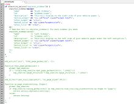
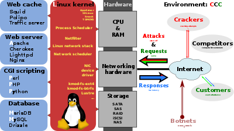
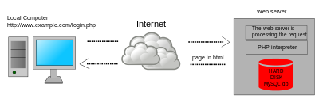

<p><strong>PHP</strong>&nbsp;is a popular general-purpose scripting language that is especially suited to web development. It was originally created by&nbsp;<a title="Rasmus Lerdorf" href="https://en.wikipedia.org/wiki/Rasmus_Lerdorf">Rasmus Lerdorf</a>&nbsp;in 1994;&nbsp;the PHP&nbsp;<a title="Reference implementation" href="https://en.wikipedia.org/wiki/Reference_implementation">reference implementation</a>&nbsp;is now produced by The PHP Group.&nbsp;PHP originally stood for&nbsp;<em>Personal Home Page</em>,&nbsp;but it now stands for the&nbsp;<a class="mw-redirect" title="Recursive initialism" href="https://en.wikipedia.org/wiki/Recursive_initialism">recursive initialism</a>&nbsp;<em>PHP: Hypertext Preprocessor</em>.</p>
<p>PHP code is usually processed on a web server by a PHP&nbsp;<a title="Interpreter (computing)" href="https://en.wikipedia.org/wiki/Interpreter_(computing)">interpreter</a>&nbsp;implemented as a&nbsp;<a class="mw-redirect" title="Plugin (computing)" href="https://en.wikipedia.org/wiki/Plugin_(computing)">module</a>, a&nbsp;<a title="Daemon (computing)" href="https://en.wikipedia.org/wiki/Daemon_(computing)">daemon</a>&nbsp;or as a&nbsp;<a title="Common Gateway Interface" href="https://en.wikipedia.org/wiki/Common_Gateway_Interface">Common Gateway Interface</a>&nbsp;(CGI) executable. On a web server, the result of the interpreted and executed PHP code &mdash; which may be any type of data, such as generated HTML or binary image data &mdash; would form the whole or part of a HTTP response. Various&nbsp;<a title="Web template system" href="https://en.wikipedia.org/wiki/Web_template_system">web template systems</a>, web&nbsp;<a title="Content management system" href="https://en.wikipedia.org/wiki/Content_management_system">content management systems</a>, and&nbsp;<a title="Web framework" href="https://en.wikipedia.org/wiki/Web_framework">web frameworks</a>&nbsp;exist which can be employed to orchestrate or facilitate the generation of that response. Additionally, PHP can be used for many programming tasks outside of the web context, such as&nbsp;<a class="mw-redirect" title="Computer software" href="https://en.wikipedia.org/wiki/Computer_software">standalone</a>&nbsp;<a title="Graphical user interface" href="https://en.wikipedia.org/wiki/Graphical_user_interface">graphical applications</a>&nbsp;and robotic&nbsp;<a title="Unmanned aerial vehicle" href="https://en.wikipedia.org/wiki/Unmanned_aerial_vehicle">drone</a>&nbsp;control. Arbitrary PHP code can also be interpreted and executed via&nbsp;<a title="Command-line interface" href="https://en.wikipedia.org/wiki/Command-line_interface">command line interface</a>&nbsp;(CLI).</p>
<p>The standard PHP interpreter, powered by the&nbsp;<a title="Zend Engine" href="https://en.wikipedia.org/wiki/Zend_Engine">Zend Engine</a>, is&nbsp;<a title="Free software" href="https://en.wikipedia.org/wiki/Free_software">free software</a>&nbsp;released under the&nbsp;<a title="PHP License" href="https://en.wikipedia.org/wiki/PHP_License">PHP License</a>. PHP has been widely ported and can be deployed on most web servers on almost every&nbsp;<a title="Operating system" href="https://en.wikipedia.org/wiki/Operating_system">operating system</a>&nbsp;and&nbsp;<a title="Computing platform" href="https://en.wikipedia.org/wiki/Computing_platform">platform</a>, free of charge.</p>
<p>The PHP language evolved without a written&nbsp;<a title="Formal specification" href="https://en.wikipedia.org/wiki/Formal_specification">formal specification</a>&nbsp;or standard until 2014, with the original implementation acting as the&nbsp;<em><a title="De facto" href="https://en.wikipedia.org/wiki/De_facto">de facto</a></em>&nbsp;standard which other implementations aimed to follow. Since 2014, work has gone on to create a formal PHP specification.</p>
<p>As of February&nbsp;2020, over half of sites on the web using PHP are still on&nbsp;<a title="End-of-life (product)" href="https://en.wikipedia.org/wiki/End-of-life_(product)#Computing">discontinued/"EOLed"</a>&nbsp;version 5.6 or older;&nbsp;and over 55% of all websites in the world run versions prior to 7.2, that are neither officially supported by The PHP Development Team,&nbsp;while security support is provided by third parties, such as&nbsp;<a title="Debian" href="https://en.wikipedia.org/wiki/Debian">Debian</a>&nbsp;(up to June 2020 for PHP 5).</p>
</br>

<table class="infobox vevent">
<tbody>
<tr>
<td colspan="2"><a class="image" href="PHP-logo.png"></a></td>
</tr>
<tr>
<th scope="row"><a title="Programming paradigm" href="https://en.wikipedia.org/wiki/Programming_paradigm">Paradigm</a></th>
<td><a title="Imperative programming" href="https://en.wikipedia.org/wiki/Imperative_programming">Imperative</a>,&nbsp;<a title="Functional programming" href="https://en.wikipedia.org/wiki/Functional_programming">functional</a>,&nbsp;<a title="Object-oriented programming" href="https://en.wikipedia.org/wiki/Object-oriented_programming">object-oriented</a>,&nbsp;<a title="Procedural programming" href="https://en.wikipedia.org/wiki/Procedural_programming">procedural</a>,&nbsp;<a class="mw-redirect" title="Reflective programming" href="https://en.wikipedia.org/wiki/Reflective_programming">reflective</a></td>
</tr>
<tr>
<th scope="row"><a title="Software design" href="https://en.wikipedia.org/wiki/Software_design">Designed&nbsp;by</a></th>
<td><a title="Rasmus Lerdorf" href="https://en.wikipedia.org/wiki/Rasmus_Lerdorf">Rasmus Lerdorf</a></td>
</tr>
<tr>
<th scope="row"><a class="mw-redirect" title="Software developer" href="https://en.wikipedia.org/wiki/Software_developer">Developer</a></th>
<td class="organiser">The PHP Development Team,&nbsp;<a title="Zend Technologies" href="https://en.wikipedia.org/wiki/Zend_Technologies">Zend Technologies</a></td>
</tr>
<tr>
<th scope="row">First&nbsp;appeared</th>
<td>1995<span class="noprint">; 25&nbsp;years ago</span></td>
</tr>
<tr>
<td colspan="2">&nbsp;</td>
</tr>
<tr>
<th scope="row"><a title="Software release life cycle" href="https://en.wikipedia.org/wiki/Software_release_life_cycle">Stable release</a></th>
<td>
<div>7.4.3&nbsp;/ February&nbsp;20, 2020<span class="noprint">; 17 days ago</span></div>
</td>
</tr>
<tr>
<th scope="row"><a title="Type system" href="https://en.wikipedia.org/wiki/Type_system">Typing discipline</a></th>
<td><a class="mw-redirect" title="Dynamic typing" href="https://en.wikipedia.org/wiki/Dynamic_typing">Dynamic</a>,&nbsp;<a class="mw-redirect" title="Weak typing" href="https://en.wikipedia.org/wiki/Weak_typing">weak</a>
<p><strong>since version 7.0:</strong></p>
<a title="Gradual typing" href="https://en.wikipedia.org/wiki/Gradual_typing">Gradual</a></td>
</tr>
<tr>
<th scope="row">Implementation language</th>
<td><a title="C (programming language)" href="https://en.wikipedia.org/wiki/C_(programming_language)">C</a>&nbsp;(primarily; some components&nbsp;<a title="C++" href="https://en.wikipedia.org/wiki/C%2B%2B">C++</a>)</td>
</tr>
<tr>
<th scope="row"><a title="Operating system" href="https://en.wikipedia.org/wiki/Operating_system">OS</a></th>
<td><a title="Unix-like" href="https://en.wikipedia.org/wiki/Unix-like">Unix-like</a>,&nbsp;<a class="mw-redirect" title="Windows" href="https://en.wikipedia.org/wiki/Windows">Windows</a></td>
</tr>
<tr>
<th scope="row"><a title="Software license" href="https://en.wikipedia.org/wiki/Software_license">License</a></th>
<td><a title="PHP License" href="https://en.wikipedia.org/wiki/PHP_License">PHP License</a>&nbsp;(most of Zend engine under&nbsp;<a class="mw-redirect" title="Zend Engine License" href="https://en.wikipedia.org/wiki/Zend_Engine_License">Zend Engine License</a>)</td>
</tr>
<tr>
<th scope="row"><a title="Filename extension" href="https://en.wikipedia.org/wiki/Filename_extension">Filename extensions</a></th>
<td><code>.php</code>,&nbsp;<code>.phtml</code>,&nbsp;<code>.php3</code>,&nbsp;<code>.php4</code>,&nbsp;<code>.php5</code>,&nbsp;<code>.php7</code>,&nbsp;<code>.phps</code>,&nbsp;<code>.php-s</code>,&nbsp;<code>.pht</code>,&nbsp;<code>.phar</code></td>
</tr>
<tr>
<th scope="row">Website</th>
<td><span class="url"><a class="external text" href="https://www.php.net/" rel="nofollow">www<wbr />.php<wbr />.net</a></span></td>
</tr>
<tr>
<th colspan="2">Major&nbsp;<a title="Programming language implementation" href="https://en.wikipedia.org/wiki/Programming_language_implementation">implementations</a></th>
</tr>
<tr>
<td colspan="2"><a title="Zend Engine" href="https://en.wikipedia.org/wiki/Zend_Engine">Zend Engine</a>,&nbsp;<a title="HHVM" href="https://en.wikipedia.org/wiki/HHVM">HHVM</a>,&nbsp;<a title="Phalanger (compiler)" href="https://en.wikipedia.org/wiki/Phalanger_(compiler)">Phalanger</a>,&nbsp;<a class="mw-redirect" title="Quercus (software)" href="https://en.wikipedia.org/wiki/Quercus_(software)">Quercus</a>,&nbsp;<a title="Parrot virtual machine" href="https://en.wikipedia.org/wiki/Parrot_virtual_machine">Parrot</a></td>
</tr>
<tr>
<th colspan="2">Influenced by</th>
</tr>
<tr>
<td colspan="2"><a title="Perl" href="https://en.wikipedia.org/wiki/Perl">Perl</a>,&nbsp;<a title="C (programming language)" href="https://en.wikipedia.org/wiki/C_(programming_language)">C</a>,&nbsp;<a title="C++" href="https://en.wikipedia.org/wiki/C%2B%2B">C++</a>,&nbsp;<a title="Java (programming language)" href="https://en.wikipedia.org/wiki/Java_(programming_language)">Java</a>,&nbsp;<a title="Tcl" href="https://en.wikipedia.org/wiki/Tcl">Tcl</a>,<span style="font-size: xx-small;">&nbsp;</span><a title="JavaScript" href="https://en.wikipedia.org/wiki/JavaScript">JavaScript</a>,&nbsp;<a title="Hack (programming language)" href="https://en.wikipedia.org/wiki/Hack_(programming_language)">Hack</a></td>
</tr>
<tr>
<th colspan="2">Influenced</th>
</tr>
<tr>
<td colspan="2"><a title="Hack (programming language)" href="https://en.wikipedia.org/wiki/Hack_(programming_language)">Hack</a></td>
</tr>
<tr>
<td class="hlist" colspan="2">
<p><a class="image" href="logo.png"></a>&nbsp;<a class="extiw" title="wikibooks:PHP Programming" href="https://en.wikibooks.org/wiki/PHP_Programming">PHP Programming</a>&nbsp;at Wikibooks</p>
</td>
</tr>
</tbody>
</table>
</br>


<div class="toctitle" dir="ltr" lang="en">
<h2 id="mw-toc-heading">Contents</h2>
<label class="toctogglelabel" for="toctogglecheckbox"></label></div>
<ul>
<li class="toclevel-1 tocsection-1"><a href="#History"><span class="toctext">History</span></a>
<ul>
<li class="toclevel-2 tocsection-2"><a href="#Early_history"><span class="toctext">Early history</span></a></li>
<li class="toclevel-2 tocsection-3"><a href="#PHP_3_and_4"><span class="toctext">PHP 3 and 4</span></a></li>
<li class="toclevel-2 tocsection-4"><a href="#PHP_5"><span class="toctext">PHP 5</span></a></li>
<li class="toclevel-2 tocsection-5"><a href="#PHP_6_and_Unicode"><span class="toctext">PHP 6 and Unicode</span></a></li>
<li class="toclevel-2 tocsection-6"><a href="#PHP_7"><span class="toctext">PHP 7</span></a></li>
<li class="toclevel-2 tocsection-7"><a href="#Release_history"><span class="toctext">Release history</span></a></li>
</ul>
</li>
<li class="toclevel-1 tocsection-8"><a href="#Mascot"><span class="toctext">Mascot</span></a></li>
<li class="toclevel-1 tocsection-9"><a href="#Syntax"><span class="toctext">Syntax</span></a>
<ul>
<li class="toclevel-2 tocsection-10"><a href="#Data_types"><span class="toctext">Data types</span></a></li>
<li class="toclevel-2 tocsection-11"><a href="#Functions"><span class="toctext">Functions</span></a></li>
<li class="toclevel-2 tocsection-12"><a href="#PHP_Objects"><span class="toctext">PHP Objects</span></a></li>
</ul>
</li>
<li class="toclevel-1 tocsection-13"><a href="#Implementations"><span class="toctext">Implementations</span></a></li>
<li class="toclevel-1 tocsection-14"><a href="#Licensing"><span class="toctext">Licensing</span></a></li>
<li class="toclevel-1 tocsection-15"><a href="#Development_and_community"><span class="toctext">Development and community</span></a></li>
<li class="toclevel-1 tocsection-16"><a href="#Installation_and_configuration"><span class="toctext">Installation and configuration</span></a></li>
<li class="toclevel-1 tocsection-17"><a href="#Use"><span class="toctext">Use</span></a></li>
<li class="toclevel-1 tocsection-18"><a href="#Security"><span class="toctext">Security</span></a></li>
 <li class="toclevel-1 tocsection-19"><a href="#Books"><span class="toctext">Books</span></a></li>
</ul>
<h2>&nbsp;</h2>
<h2><span id="History" class="mw-headline">History</span></h2>
<h3><span id="Early_history" class="mw-headline">Early history</span></h3>
<div class="thumb tmulti tleft">
<div class="thumbinner">
<div class="trow">
<div class="tsingle">
<div class="thumbimage"><a class="image" href="Rasmus_Lerdorf.jpg"></a></div>
</div>
<div class="tsingle">
<div class="thumbimage"><a class="image" href="Andi_Gutmans.jpg"></a></div>
</div>
<div class="tsingle">
<div class="thumbimage"><a class="image" href="Zeev_Suraski.jpg"></a></div>
</div>
</div>
<div class="trow">
<div class="thumbcaption"><a title="Rasmus Lerdorf" href="https://en.wikipedia.org/wiki/Rasmus_Lerdorf">Rasmus Lerdorf</a>, who wrote the original&nbsp;<a title="Common Gateway Interface" href="https://en.wikipedia.org/wiki/Common_Gateway_Interface">Common Gateway Interface</a>&nbsp;(CGI) component, together with&nbsp;<a title="Andi Gutmans" href="https://en.wikipedia.org/wiki/Andi_Gutmans">Andi Gutmans</a>&nbsp;and&nbsp;<a title="Zeev Suraski" href="https://en.wikipedia.org/wiki/Zeev_Suraski">Zeev Suraski</a>, who rewrote the&nbsp;<a class="mw-redirect" title="Parser" href="https://en.wikipedia.org/wiki/Parser">parser</a>&nbsp;that formed PHP&nbsp;3.</div>
<div class="thumbcaption">&nbsp;</div>
</div>
</div>
</div>


</br>
<h2>Publications </h2>
<ul>
 <li><a target="_blank" href="https://github.com/manjunath5496/PHP-Tutorial/blob/master/pho(1).pdf" style="text-decoration:none;">PHP - Advanced Tutorial</a></li>
                            
 <li><a target="_blank" href="https://github.com/manjunath5496/PHP-Tutorial/blob/master/pho(2).pdf" style="text-decoration:none;">Programming PHP</a></li>

<li><a target="_blank" href="https://github.com/manjunath5496/PHP-Tutorial/blob/master/pho(3).pdf" style="text-decoration:none;">PHP Tips and Tricks</a></li>
 <li><a target="_blank" href="https://github.com/manjunath5496/PHP-Tutorial/blob/master/pho(4).pdf" style="text-decoration:none;">PHP Pocket Reference</a></li>                              
<li><a target="_blank" href="https://github.com/manjunath5496/PHP-Tutorial/blob/master/pho(5).pdf" style="text-decoration:none;">Interview PHP's Creator, Rasmus Lerdorf</a></li>

</ul>

</br>


<p>PHP development began in 1994 when&nbsp;<a title="Rasmus Lerdorf" href="https://en.wikipedia.org/wiki/Rasmus_Lerdorf">Rasmus Lerdorf</a>&nbsp;wrote several&nbsp;<a title="Common Gateway Interface" href="https://en.wikipedia.org/wiki/Common_Gateway_Interface">Common Gateway Interface</a>&nbsp;(CGI) programs in C,&nbsp;which he used to maintain his&nbsp;<a class="mw-redirect" title="Personal homepage" href="https://en.wikipedia.org/wiki/Personal_homepage">personal homepage</a>. He extended them to work with&nbsp;<a class="mw-redirect" title="Web form" href="https://en.wikipedia.org/wiki/Web_form">web forms</a>&nbsp;and to communicate with&nbsp;<a title="Database" href="https://en.wikipedia.org/wiki/Database">databases</a>, and called this implementation "Personal Home Page/Forms Interpreter" or PHP/FI.</p>
<p>PHP/FI could be used to build simple,&nbsp;<a class="mw-redirect" title="Dynamic web application" href="https://en.wikipedia.org/wiki/Dynamic_web_application">dynamic web applications</a>. To accelerate&nbsp;<a title="Software bug" href="https://en.wikipedia.org/wiki/Software_bug">bug</a>&nbsp;reporting and improve the code, Lerdorf initially announced the release of PHP/FI as "Personal Home Page Tools (PHP Tools) version 1.0" on the&nbsp;<a title="Usenet" href="https://en.wikipedia.org/wiki/Usenet">Usenet</a>&nbsp;discussion group&nbsp;<em>comp.infosystems.www.authoring.cgi</em>&nbsp;on June 8, 1995.&nbsp;This release already had the basic functionality that PHP has today. This included&nbsp;<a title="Local variable" href="https://en.wikipedia.org/wiki/Local_variable#Local_variables_in_Perl">Perl-like variables</a>, form handling, and the ability to embed HTML. The&nbsp;<a title="Syntax" href="https://en.wikipedia.org/wiki/Syntax">syntax</a>&nbsp;resembled that of Perl, but was simpler, more limited and less consistent.</p>
<div>&nbsp;</div>
<p>An example of the early PHP syntax:</p>
<div class="mw-highlight mw-highlight-lang-php mw-content-ltr" dir="ltr">
<pre><span class="o">&lt;!--</span><span class="k">include</span> <span class="o">/</span><span class="nx">text</span><span class="o">/</span><span class="nb">header</span><span class="o">.</span><span class="nx">html</span><span class="o">--&gt;</span>

<span class="o">&lt;!--</span><span class="nb">getenv</span> <span class="nx">HTTP_USER_AGENT</span><span class="o">--&gt;</span>
<span class="o">&lt;!--</span><span class="nx">ifsubstr</span> <span class="nv">$exec_result</span> <span class="nx">Mozilla</span><span class="o">--&gt;</span>
  <span class="nx">Hey</span><span class="p">,</span> <span class="nx">you</span> <span class="nx">are</span> <span class="nx">using</span> <span class="nx">Netscape</span><span class="o">!&lt;</span><span class="nx">p</span><span class="o">&gt;</span>
<span class="o">&lt;!--</span><span class="k">endif</span><span class="o">--&gt;</span>

<span class="o">&lt;!--</span><span class="nx">sql</span> <span class="nx">database</span> <span class="nx">select</span> <span class="o">*</span> <span class="nx">from</span> <span class="nx">table</span> <span class="nx">where</span> <span class="nx">user</span><span class="o">=</span><span class="s1">'$username'</span><span class="o">--&gt;</span>
<span class="o">&lt;!--</span><span class="nx">ifless</span> <span class="nv">$numentries</span> <span class="mi">1</span><span class="o">--&gt;</span>
  <span class="nx">Sorry</span><span class="p">,</span> <span class="nx">that</span> <span class="nx">record</span> <span class="nx">does</span> <span class="k">not</span> <span class="nx">exist</span><span class="o">&lt;</span><span class="nx">p</span><span class="o">&gt;</span>
<span class="o">&lt;!--</span><span class="k">endif</span> <span class="k">exit</span><span class="o">--&gt;</span>
  <span class="nx">Welcome</span> <span class="o">&lt;!--</span><span class="nv">$user</span><span class="o">--&gt;!&lt;</span><span class="nx">p</span><span class="o">&gt;</span>
  <span class="nx">You</span> <span class="nx">have</span> <span class="o">&lt;!--</span><span class="nv">$index</span><span class="o">:</span><span class="mi">0</span><span class="o">--&gt;</span> <span class="nx">credits</span> <span class="nx">left</span> <span class="nx">in</span> <span class="nx">your</span> <span class="nx">account</span><span class="o">.&lt;</span><span class="nx">p</span><span class="o">&gt;</span>

<span class="o">&lt;!--</span><span class="k">include</span> <span class="o">/</span><span class="nx">text</span><span class="o">/</span><span class="nx">footer</span><span class="o">.</span><span class="nx">html</span><span class="o">--&gt;</span>
</pre>
</div>
<p>Early PHP was not intended to be a new&nbsp;<a title="Programming language theory" href="https://en.wikipedia.org/wiki/Programming_language_theory">programming language</a>, and grew organically, with Lerdorf noting in retrospect: "I don't know how to stop it, there was never any intent to write a programming language [...] I have absolutely no idea how to write a programming language, I just kept adding the next logical step on the way."&nbsp;A development team began to form and, after months of work and&nbsp;<a class="mw-redirect" title="Beta development stage" href="https://en.wikipedia.org/wiki/Beta_development_stage">beta</a>&nbsp;testing, officially released PHP/FI 2 in November 1997.</p>
<p>The fact that PHP was not originally designed, but instead was developed organically has led to inconsistent naming of functions and inconsistent ordering of their parameters.&nbsp;In some cases, the function names were chosen to match the lower-level libraries which PHP was "wrapping",&nbsp;while in some very early versions of PHP the length of the function names was used internally as a&nbsp;<a title="Hash function" href="https://en.wikipedia.org/wiki/Hash_function">hash function</a>, so names were chosen to improve the distribution of hash values.</p>
<p>&nbsp;</p>
<h3><span id="PHP_3_and_4" class="mw-headline">PHP 3 and 4</span></h3>
<div class="thumb tright">
<div class="thumbinner"><a class="image" href="Custom-software-developement.JPG"></a>
<div class="thumbcaption">
<div class="magnify">&nbsp;</div>
This is an example of custom PHP code for the&nbsp;<a title="WordPress" href="https://en.wikipedia.org/wiki/WordPress">WordPress</a>&nbsp;<a title="Content management system" href="https://en.wikipedia.org/wiki/Content_management_system">content management system</a>.</div>
<div class="thumbcaption">&nbsp;</div>
</div>
</div>
<p><a title="Zeev Suraski" href="https://en.wikipedia.org/wiki/Zeev_Suraski">Zeev Suraski</a>&nbsp;and&nbsp;<a title="Andi Gutmans" href="https://en.wikipedia.org/wiki/Andi_Gutmans">Andi Gutmans</a>&nbsp;rewrote the&nbsp;<a class="mw-redirect" title="Parser" href="https://en.wikipedia.org/wiki/Parser">parser</a>&nbsp;in 1997 and formed the base of PHP&nbsp;3, changing the language's name to the&nbsp;<a title="Recursive acronym" href="https://en.wikipedia.org/wiki/Recursive_acronym">recursive acronym</a>&nbsp;<em>PHP: Hypertext Preprocessor</em>.&nbsp;Afterwards, public testing of PHP&nbsp;3 began, and the official launch came in June 1998. Suraski and Gutmans then started a new&nbsp;<a title="Rewrite (programming)" href="https://en.wikipedia.org/wiki/Rewrite_(programming)">rewrite</a>&nbsp;of PHP's core, producing the&nbsp;<a title="Zend Engine" href="https://en.wikipedia.org/wiki/Zend_Engine">Zend Engine</a>&nbsp;in 1999.&nbsp;They also founded&nbsp;<a title="Zend Technologies" href="https://en.wikipedia.org/wiki/Zend_Technologies">Zend Technologies</a>&nbsp;in&nbsp;<a title="Ramat Gan" href="https://en.wikipedia.org/wiki/Ramat_Gan">Ramat Gan</a>, Israel.</p>
<p>On May 22, 2000, PHP 4, powered by the Zend Engine 1.0, was released.&nbsp;As of August 2008 this branch reached version 4.4.9. PHP&nbsp;4 is no longer under development nor will any security updates be released.</p>
<h3><span id="PHP_5" class="mw-headline">PHP 5</span></h3>
<p>On July 14, 2004, PHP 5 was released, powered by the new Zend Engine II.&nbsp;PHP&nbsp;5 included new features such as improved support for&nbsp;<a title="Object-oriented programming" href="https://en.wikipedia.org/wiki/Object-oriented_programming">object-oriented programming</a>, the PHP Data Objects (PDO) extension (which defines a lightweight and consistent interface for accessing databases), and numerous performance enhancements.&nbsp;In 2008, PHP&nbsp;5 became the only stable version under development.&nbsp;<a class="mw-redirect" title="Late static binding" href="https://en.wikipedia.org/wiki/Late_static_binding">Late static binding</a>&nbsp;had been missing from PHP and was added in version 5.3.</p>
<p>Many high-profile open-source projects ceased to support PHP&nbsp;4 in new code as of February 5, 2008, because of the GoPHP5 initiative,&nbsp;provided by a consortium of PHP developers promoting the transition from PHP&nbsp;4 to PHP&nbsp;5.</p>
<p>Over time, PHP interpreters became available on most existing&nbsp;<a class="mw-redirect" title="32-bit" href="https://en.wikipedia.org/wiki/32-bit">32-bit</a>&nbsp;and&nbsp;<a class="mw-redirect" title="64-bit" href="https://en.wikipedia.org/wiki/64-bit">64-bit</a>&nbsp;operating systems, either by building them from the PHP source code, or by using pre-built binaries.<sup id="cite_ref-36" class="reference"><a href="https://en.wikipedia.org/wiki/PHP#cite_note-36">[36]</a></sup>&nbsp;For PHP versions 5.3 and 5.4, the only available&nbsp;<a title="Microsoft Windows" href="https://en.wikipedia.org/wiki/Microsoft_Windows">Microsoft Windows</a>&nbsp;binary distributions were 32-bit&nbsp;<a title="IA-32" href="https://en.wikipedia.org/wiki/IA-32">IA-32</a>&nbsp;builds,&nbsp;requiring Windows 32-bit compatibility mode while using&nbsp;<a title="Internet Information Services" href="https://en.wikipedia.org/wiki/Internet_Information_Services">Internet Information Services</a>&nbsp;(IIS) on a 64-bit Windows platform. PHP version 5.5 made the 64-bit&nbsp;<a title="X86-64" href="https://en.wikipedia.org/wiki/X86-64">x86-64</a>&nbsp;builds available for Microsoft Windows.</p>
<p>Official security support for PHP 5.6 ended on 31 December 2018,&nbsp;but&nbsp;<a title="Debian" href="https://en.wikipedia.org/wiki/Debian">Debian 8.0 Jessie</a>&nbsp;will extend support until June 2020.</p>
<h3><span id="PHP_6_and_Unicode" class="mw-headline"><span id="PHP6-UNICODE">PHP 6 and Unicode</span></span></h3>
<p>PHP received mixed reviews due to lacking native&nbsp;<a title="Unicode" href="https://en.wikipedia.org/wiki/Unicode">Unicode</a>&nbsp;support at the core language level.&nbsp;In 2005, a project headed by Andrei Zmievski was initiated to bring native Unicode support throughout PHP, by embedding the&nbsp;<a title="International Components for Unicode" href="https://en.wikipedia.org/wiki/International_Components_for_Unicode">International Components for Unicode</a>&nbsp;(ICU) library, and representing text strings as&nbsp;<a title="UTF-16" href="https://en.wikipedia.org/wiki/UTF-16">UTF-16</a>&nbsp;internally.&nbsp;Since this would cause major changes both to the internals of the language and to user code, it was planned to release this as version 6.0 of the language, along with other major features then in development.</p>
<p>However, a shortage of developers who understood the necessary changes, and performance problems arising from conversion to and from UTF-16, which is rarely used in a web context, led to delays in the project.&nbsp;As a result, a PHP&nbsp;5.3 release was created in 2009, with many non-Unicode features back-ported from PHP&nbsp;6, notably namespaces. In March 2010, the project in its current form was officially abandoned, and a PHP&nbsp;5.4 release was prepared containing most remaining non-Unicode features from PHP&nbsp;6, such as traits and closure re-binding.&nbsp;Initial hopes were that a new plan would be formed for Unicode integration, but as of 2014&nbsp;none had been adopted.</p>
<h3><span id="PHP_7" class="mw-headline"><span id="NG"><span id="ZE3"><span id="PHP7">PHP 7</span></span></span></span></h3>
<p>During 2014 and 2015, a new major PHP version was developed, which was numbered PHP&nbsp;7. The numbering of this version involved some debate.&nbsp;While the PHP&nbsp;6 Unicode experiment had never been released, several articles and book titles referenced the PHP&nbsp;6 name, which might have caused confusion if a new release were to reuse the name.&nbsp;After a vote, the name PHP&nbsp;7 was chosen.</p>
<p>The foundation of PHP 7 is a PHP&nbsp;<a title="Branching (version control)" href="https://en.wikipedia.org/wiki/Branching_(version_control)">branch</a>&nbsp;that was originally dubbed&nbsp;<em>PHP next generation</em>&nbsp;(<em>phpng</em>). It was authored by Dmitry Stogov, Xinchen Hui and Nikita Popov,&nbsp;and aimed to optimize PHP performance by refactoring the Zend Engine while retaining near-complete language compatibility.<sup id="cite_ref-51" class="reference"><a href="https://en.wikipedia.org/wiki/PHP#cite_note-51">[51]</a></sup>&nbsp;As of 14&nbsp;July&nbsp;2014,&nbsp;<a title="WordPress" href="https://en.wikipedia.org/wiki/WordPress">WordPress</a>-based benchmarks, which served as the main benchmark suite for the phpng project, showed an almost 100% increase in performance. Changes from phpng are also expected to make it easier to improve performance in the future, as more compact data structures and other changes are seen as better suited for a successful migration to a&nbsp;<a title="Just-in-time compilation" href="https://en.wikipedia.org/wiki/Just-in-time_compilation">just-in-time</a>&nbsp;(JIT) compiler.&nbsp;Because of the significant changes, the reworked Zend Engine is called&nbsp;<em>Zend Engine 3</em>, succeeding Zend Engine 2 used in PHP&nbsp;5.</p>
<p>Because of major internal changes in phpng it must receive a new&nbsp;<a title="Software versioning" href="https://en.wikipedia.org/wiki/Software_versioning">major version</a>&nbsp;number of PHP, rather than a minor PHP&nbsp;5 release, according to PHP's release process.&nbsp;Major versions of PHP are allowed to break backward-compatibility of code and therefore PHP&nbsp;7 presented an opportunity for other improvements beyond phpng that require backward-compatibility breaks. In particular, it involved the following changes:</p>
<ul>
<li>Many fatal- or recoverable-level legacy PHP error mechanisms were replaced with modern object-oriented&nbsp;<a class="mw-redirect" title="Exception (computer science)" href="https://en.wikipedia.org/wiki/Exception_(computer_science)">exceptions</a></li>
<li>The syntax for variable dereferencing was reworked to be internally more consistent and complete, allowing the use of the operators&nbsp;<code>-&gt;</code>,&nbsp;<code>[]</code>,&nbsp;<code>()</code>,<code>{}</code>, and&nbsp;<code>::</code>, with arbitrary meaningful left-side expressions</li>
<li>Support for legacy PHP&nbsp;4-style constructor methods was deprecated</li>
<li>The behavior of the&nbsp;<a title="Foreach loop" href="https://en.wikipedia.org/wiki/Foreach_loop"><code>foreach</code>&nbsp;statement</a>&nbsp;was changed to be more predictable</li>
<li>Constructors for the few classes built-in to PHP which returned null upon failure were changed to throw an exception instead, for consistency</li>
<li>Several unmaintained or deprecated&nbsp;<a class="mw-redirect" title="Server application programming interface" href="https://en.wikipedia.org/wiki/Server_application_programming_interface">server application programming interfaces</a>&nbsp;(SAPIs) and extensions were removed from the PHP core, most notably the legacy&nbsp;<code>mysql</code>&nbsp;extension<sup id="cite_ref-60" class="reference"><a href="https://en.wikipedia.org/wiki/PHP#cite_note-60">[60]</a></sup></li>
<li>The behavior of the&nbsp;<code>list()</code>&nbsp;operator was changed to remove support for strings</li>
<li>Support was removed for legacy ASP-style delimiters&nbsp;<code>&lt;%</code>&nbsp;and&nbsp;<code>%&gt;</code>&nbsp;and&nbsp;<code>&lt;script language="php"&gt; ... &lt;/script&gt;</code></li>
<li>An oversight allowing a&nbsp;<a title="Switch statement" href="https://en.wikipedia.org/wiki/Switch_statement">switch statement</a>&nbsp;to have multiple&nbsp;<code>default</code>&nbsp;clauses was fixed</li>
<li>Support for hexadecimal number support in some implicit conversions from strings to number types was removed</li>
<li>The&nbsp;<a class="mw-redirect" title="Left-shift operator" href="https://en.wikipedia.org/wiki/Left-shift_operator">left-shift</a>&nbsp;and&nbsp;<a class="mw-redirect" title="Right-shift operator" href="https://en.wikipedia.org/wiki/Right-shift_operator">right-shift</a>&nbsp;operators were changed to behave more consistently across platforms</li>
<li>Conversions between integers and floating point numbers were tightened and implemented more consistently across platforms</li>
</ul>
<p>PHP 7 also included new language features. Most notably, it introduces return type declarations for functions&nbsp;which complement the existing parameter type declarations, and support for the&nbsp;<a title="Variable (computer science)" href="https://en.wikipedia.org/wiki/Variable_(computer_science)">scalar</a>&nbsp;types (integer, float, string, and boolean) in parameter and return type declarations.</p>
<h3><span id="Release_history" class="mw-headline">Release history</span></h3>
<table class="wikitable">
<tbody>
<tr>
<th>Version</th>
<th>Release date</th>
<th>Supported until</th>
<th>Notes</th>
</tr>
<tr>
<td title="Old version, no longer maintained" data-sort-value="1.0">1.0</td>
<td>8 June 1995</td>
<td>&nbsp;</td>
<td>Officially called "Personal Home Page Tools (PHP Tools)". This is the first use of the name "PHP".</td>
</tr>
<tr>
<td title="Old version, no longer maintained" data-sort-value="2.0">2.0</td>
<td>1 November 1997</td>
<td>&nbsp;</td>
<td>Officially called "PHP/FI 2.0". This is the first release that could actually be characterised as PHP, being a standalone language with many features that have endured to the present day.</td>
</tr>
<tr>
<td title="Old version, no longer maintained" data-sort-value="3.0">3.0</td>
<td>6 June 1998</td>
<td>20 October 2000</td>
<td>Development moves from one person to multiple developers. Zeev Suraski and Andi Gutmans rewrite the base for this version.</td>
</tr>
<tr>
<td title="Old version, no longer maintained" data-sort-value="4.0">4.0</td>
<td>22 May 2000</td>
<td>23 June 2001</td>
<td>Added more advanced two-stage parse/execute tag-parsing system called the Zend engine.</td>
</tr>
<tr>
<td title="Old version, no longer maintained" data-sort-value="4.1">4.1</td>
<td>10 December 2001</td>
<td>12 March 2002</td>
<td>Introduced "superglobals" (<code id="" class="mw-highlight mw-highlight-lang-php" dir="ltr"><span class="nv">$_GET</span></code>,&nbsp;<code id="" class="mw-highlight mw-highlight-lang-php" dir="ltr"><span class="nv">$_POST</span></code>,&nbsp;<code id="" class="mw-highlight mw-highlight-lang-php" dir="ltr"><span class="nv">$_SESSION</span></code>, etc.)</td>
</tr>
<tr>
<td title="Old version, no longer maintained" data-sort-value="4.2">4.2</td>
<td>22 April 2002</td>
<td>6 September 2002</td>
<td>Disabled&nbsp;<code>register_globals</code>&nbsp;by default. Data received over the network is not inserted directly into the&nbsp;<a title="Global variable" href="https://en.wikipedia.org/wiki/Global_variable">global</a>&nbsp;namespace anymore, closing possible security holes in applications.</td>
</tr>
<tr>
<td title="Old version, no longer maintained" data-sort-value="4.3">4.3</td>
<td>27 December 2002</td>
<td>31 March 2005</td>
<td>Introduced the&nbsp;<a title="Command-line interface" href="https://en.wikipedia.org/wiki/Command-line_interface">command-line interface</a>&nbsp;(CLI), to supplement the CGI.</td>
</tr>
<tr>
<td title="Old version, no longer maintained" data-sort-value="4.4">4.4</td>
<td>11 July 2005</td>
<td>7 August 2008</td>
<td>Fixed a memory corruption bug, which required breaking binary compatibility with extensions compiled against PHP version 4.3.x.</td>
</tr>
<tr>
<td title="Old version, no longer maintained" data-sort-value="5.0">5.0</td>
<td>13 July 2004</td>
<td>5 September 2005</td>
<td>Zend Engine II with a new object model.</td>
</tr>
<tr>
<td title="Old version, no longer maintained" data-sort-value="5.1">5.1</td>
<td>24 November 2005</td>
<td>24 August 2006</td>
<td>Performance improvements with introduction of compiler variables in re-engineered PHP Engine.&nbsp;Added PHP Data Objects (PDO) as a consistent interface for accessing databases.</td>
</tr>
<tr>
<td title="Old version, no longer maintained" data-sort-value="5.2">5.2</td>
<td>2 November 2006</td>
<td>6 January 2011</td>
<td>Enabled the filter extension by default. Native&nbsp;<a title="JSON" href="https://en.wikipedia.org/wiki/JSON">JSON</a>&nbsp;support.</td>
</tr>
<tr>
<td title="Old version, no longer maintained" data-sort-value="5.3">5.3</td>
<td>30 June 2009</td>
<td>14 August 2014</td>
<td><a title="Namespace" href="https://en.wikipedia.org/wiki/Namespace">Namespace</a>&nbsp;support;&nbsp;<a title="Name binding" href="https://en.wikipedia.org/wiki/Name_binding">late static bindings</a>, jump label (limited&nbsp;<a title="Goto" href="https://en.wikipedia.org/wiki/Goto">goto</a>),&nbsp;<a class="mw-redirect" title="Closure (computer science)" href="https://en.wikipedia.org/wiki/Closure_(computer_science)">closures</a>, PHP archives (phar),&nbsp;<a title="Garbage collection (computer science)" href="https://en.wikipedia.org/wiki/Garbage_collection_(computer_science)">garbage collection</a>&nbsp;for circular references, improved&nbsp;<a title="Microsoft Windows" href="https://en.wikipedia.org/wiki/Microsoft_Windows">Windows</a>&nbsp;support, sqlite3, mysqlnd as a replacement for libmysql as underlying library for the extensions that work with&nbsp;<a title="MySQL" href="https://en.wikipedia.org/wiki/MySQL">MySQL</a>, fileinfo as a replacement for mime_magic for better&nbsp;<a title="MIME" href="https://en.wikipedia.org/wiki/MIME">MIME</a>&nbsp;support, the Internationalization extension, and deprecation of ereg extension.</td>
</tr>
<tr>
<td title="Old version, no longer maintained" data-sort-value="5.4">5.4</td>
<td>1 March 2012</td>
<td>3 September 2015</td>
<td><a title="Trait (computer programming)" href="https://en.wikipedia.org/wiki/Trait_(computer_programming)">Trait</a>&nbsp;support, short array syntax support. Removed items:&nbsp;<code>register_globals</code>,&nbsp;<code>safe_mode</code>,&nbsp;<code>allow_call_time_pass_reference</code>,&nbsp;<code id="" class="mw-highlight mw-highlight-lang-php" dir="ltr"><span class="nb">session_register</span><span class="p">()</span></code>,&nbsp;<code id="" class="mw-highlight mw-highlight-lang-php" dir="ltr"><span class="nb">session_unregister</span><span class="p">()</span></code>&nbsp;and&nbsp;<code id="" class="mw-highlight mw-highlight-lang-php" dir="ltr"><span class="nb">session_is_registered</span><span class="p">()</span></code>. Built-in web server.&nbsp;Several improvements to existing features, performance and reduced memory requirements.</td>
</tr>
<tr>
<td title="Old version, no longer maintained" data-sort-value="5.5">5.5</td>
<td>20 June 2013</td>
<td>10 July 2016</td>
<td>Support for&nbsp;<a title="Generator (computer programming)" href="https://en.wikipedia.org/wiki/Generator_(computer_programming)">generators</a>,&nbsp;<code>finally</code>&nbsp;blocks for exceptions handling, OpCache (based on Zend Optimizer+) bundled in official distribution.</td>
</tr>
<tr>
<td title="Old version, no longer maintained" data-sort-value="5.6">5.6</td>
<td>28 August 2014</td>
<td>31 December 2018</td>
<td>Constant scalar expressions,&nbsp;<a title="Variadic function" href="https://en.wikipedia.org/wiki/Variadic_function">variadic functions</a>, argument unpacking, new exponentiation operator, extensions of the&nbsp;<code>use</code>&nbsp;statement for functions and constants, new&nbsp;<code>phpdbg</code>&nbsp;debugger as a SAPI module, and other smaller improvements.</td>
</tr>
<tr>
<td>6.x</td>
<td class="table-na" data-sort-value="">Not released</td>
<td class="table-na" data-sort-value="">N/A</td>
<td>Abandoned version of PHP that planned to include native Unicode support.</td>
</tr>
<tr>
<td title="Old version, no longer maintained" data-sort-value="7.0">7.0</td>
<td>3 December 2015</td>
<td>3 December 2018</td>
<td>Zend Engine 3 (performance improvements&nbsp;and 64-bit integer support on Windows), uniform variable syntax,&nbsp;<a class="mw-redirect" title="Abstract Syntax Tree" href="https://en.wikipedia.org/wiki/Abstract_Syntax_Tree">AST</a>-based compilation process,&nbsp;added&nbsp;<code id="" class="mw-highlight mw-highlight-lang-php" dir="ltr"><span class="nx">Closure</span><span class="o">::</span><span class="na">call</span><span class="p">()</span></code>,&nbsp;bitwise shift consistency across platforms,<span style="font-size: xx-small;">&nbsp;</span><code id="" class="mw-highlight mw-highlight-lang-php" dir="ltr"><span class="o">??</span></code>&nbsp;(<a title="Null coalescing operator" href="https://en.wikipedia.org/wiki/Null_coalescing_operator">null coalesce</a>) operator,&nbsp;<a title="Unicode" href="https://en.wikipedia.org/wiki/Unicode">Unicode</a>&nbsp;code point&nbsp;<a title="String literal" href="https://en.wikipedia.org/wiki/String_literal#Escape_sequences">escape syntax</a>,&nbsp;return type declarations, scalar type (integer, float, string and boolean) declarations,&nbsp;<code>&lt;=&gt;</code>&nbsp;"spaceship"&nbsp;<a title="Three-way comparison" href="https://en.wikipedia.org/wiki/Three-way_comparison">three-way comparison</a>&nbsp;operator,&nbsp;<a title="Generator (computer programming)" href="https://en.wikipedia.org/wiki/Generator_(computer_programming)">generator</a>&nbsp;delegation,&nbsp;<a class="mw-redirect" title="Anonymous class" href="https://en.wikipedia.org/wiki/Anonymous_class">anonymous classes</a>,&nbsp;simpler and more consistently available&nbsp;<a class="mw-redirect" title="CSPRNG" href="https://en.wikipedia.org/wiki/CSPRNG">CSPRNG</a>&nbsp;API,&nbsp;replacement of many remaining internal PHP "errors" with the more modern&nbsp;<a class="mw-redirect" title="Exception (computer science)" href="https://en.wikipedia.org/wiki/Exception_(computer_science)">exceptions</a>,&nbsp;and shorthand syntax for importing multiple items from a namespace.</td>
</tr>
<tr>
<td title="Old version, no longer maintained" data-sort-value="7.1">7.1</td>
<td>1 December 2016</td>
<td>1 December 2019</td>
<td><a title="Void type" href="https://en.wikipedia.org/wiki/Void_type">void return type</a>,&nbsp;class constant&nbsp;<a title="Information hiding" href="https://en.wikipedia.org/wiki/Information_hiding">visibility modifiers</a></td>
</tr>
<tr>
<td class="templateVersion co" title="Older version, yet still maintained" data-sort-value="7.2">7.2</td>
<td>30 November 2017</td>
<td>30 November 2020</td>
<td>Object parameter and return type hint,&nbsp;Libsodium extension,&nbsp;Abstract method overriding,&nbsp;Parameter type widening</td>
</tr>
<tr>
<td class="templateVersion co" title="Older version, yet still maintained" data-sort-value="7.3">7.3</td>
<td>6 December 2018</td>
<td>6 December 2021</td>
<td>Flexible&nbsp;<a title="Here document" href="https://en.wikipedia.org/wiki/Here_document#PHP">Heredoc</a>&nbsp;and Nowdoc syntax,&nbsp;support for reference assignment and array deconstruction with list(),&nbsp;PCRE2 support,&nbsp;hrtime() function</td>
</tr>
<tr>
<td class="templateVersion c" title="Current stable version" data-sort-value="7.4"><strong>7.4</strong></td>
<td>28 November 2019</td>
<td>28 November 2022</td>
<td>Typed Properties 2.0,&nbsp;Preloading,&nbsp;Null Coalescing Assignment Operator,&nbsp;Improve openssl_random_pseudo_bytes,&nbsp;Weak References,&nbsp;FFI&nbsp;&ndash; Foreign Function Interface
<p>Always available hash extension,&nbsp;Password Hash Registry,&nbsp;Split multibyte string,&nbsp;Reflection for references,&nbsp;Unbundle ext/wddx,&nbsp;New custom object serialization mechanism</p>
</td>
</tr>
<tr>
<td class="templateVersion p" title="Future release" data-sort-value="8.0">8.0</td>
<td>Q4 2020 or Q1 2021</td>
<td>Q4 2023 or Q1 2024</td>
<td><a title="Just-in-time compilation" href="https://en.wikipedia.org/wiki/Just-in-time_compilation">Just In Time compilation (JIT)</a>,&nbsp;arrays starting with a negative index,&nbsp;consistent type errors for internal functions,&nbsp;fatal error for incompatible method signatures</td>
</tr>
<tr class="sortbottom">
<td colspan="4">
<div class="templateVersion l">
<div><strong>Legend:</strong></div>
<div><span title="Old version, no longer maintained">Old version</span></div>
<div><span title="An older version, yet still maintained">Older version, still maintained</span></div>
<div><span title="Latest stable version"><strong>Latest version</strong></span></div>
<div><span title="Latest preview of a future release">Latest preview version</span></div>
<div><span title="A future release">Future release</span></div>
<div>&nbsp;</div>
</div>
</td>
</tr>
</tbody>
</table>
<p>Beginning on June 28, 2011, the PHP Development Team implemented a timeline for the release of new versions of PHP.&nbsp;Under this system, at least one release should occur every month. Once per year, a minor release should occur which may include new features. Every minor release should at least be supported for two years with security and bug fixes, followed by at least one year of only security fixes, for a total of a three-year release process for every minor release. No new features, unless small and self-contained, are to be introduced into a minor release during the three-year release process. Latest versions of PHP are PHP 7.2.27, PHP 7.3.14 and PHP 7.4.3 released on 20 Feb 2020.</p>
<h2><span id="Mascot" class="mw-headline"><span id="ELEPHPANT">Mascot</span></span></h2>
<div class="thumb tright">
<div class="thumbinner"><a class="image" href="Elephpant.png"></a>
<div class="thumbcaption">
<div class="magnify">&nbsp;</div>
The elePHPant, PHP mascot</div>
</div>
</div>
<p>The mascot of the PHP project is the&nbsp;<em>elePHPant</em>, a blue&nbsp;<a title="Elephant" href="https://en.wikipedia.org/wiki/Elephant">elephant</a>&nbsp;with the PHP logo on its side, designed by Vincent Pontier&nbsp;in 1998.&nbsp;"The (PHP) letters were forming the shape of an elephant if viewed in a sideways angle."&nbsp;The elePHPant is sometimes differently colored when in&nbsp;<a class="mw-redirect" title="Plush toy" href="https://en.wikipedia.org/wiki/Plush_toy">plush toy</a>&nbsp;form.</p>
<p>Many variations of this mascot have been made over the years. Only the elePHPants based on the original design by Vincent Pontier are considered official by the community.&nbsp;These are collectible and some of them are extremely rare. Different variations are listed on&nbsp;<a class="external text" href="http://afieldguidetoelephpants.net/" rel="nofollow">A Field Guide to Elephpants</a>.</p>
<div>&nbsp;</div>
<h2><span id="Syntax" class="mw-headline">Syntax</span></h2>
<div class="hatnote navigation-not-searchable">&nbsp;</div>
<p>The following&nbsp;<a title="&quot;Hello, World!&quot; program" href="https://en.wikipedia.org/wiki/%22Hello,_World!%22_program">"Hello, World!" program</a>&nbsp;is written in PHP code embedded in an&nbsp;<a title="HTML" href="https://en.wikipedia.org/wiki/HTML">HTML</a>&nbsp;document:</p>
<div class="mw-highlight mw-highlight-lang-php mw-content-ltr" dir="ltr">
<pre><span class="x">&lt;!DOCTYPE html&gt;</span>
<span class="x">&lt;html&gt;</span>
<span class="x"> &lt;head&gt;</span>
<span class="x">  &lt;title&gt;PHP "Hello, World!" program&lt;/title&gt;</span>
<span class="x"> &lt;/head&gt;</span>
<span class="x"> &lt;body&gt;</span>
<span class="hll">  <span class="cp">&lt;?php</span> <span class="k">echo</span> <span class="s1">'&lt;p&gt;Hello, World!&lt;/p&gt;'</span><span class="p">;</span> <span class="cp">?&gt;</span>
</span><span class="x"> &lt;/body&gt;</span>
<span class="x">&lt;/html&gt;</span>
</pre>
</div>
<p>However, as no requirement exists for PHP code to be embedded in HTML, the simplest version of&nbsp;<em>Hello, World!</em>&nbsp;may be written like this, with the closing tag omitted as preferred in files containing pure PHP code</p>
<div class="mw-highlight mw-highlight-lang-php mw-content-ltr" dir="ltr">
<pre> <span class="o">&lt;?=</span><span class="s1">'Hello, World!'</span><span class="p">;</span>
</pre>
</div>
<p>As well, there is no requirement that a PHP file contain PHP code at all&nbsp;&ndash; the interpreter will output data outside of PHP tags unchanged so a simple text file containing "<code>Hello, World!</code>" will give the same output.</p>
<p>The PHP interpreter only executes PHP code within its&nbsp;<a title="Delimiter" href="https://en.wikipedia.org/wiki/Delimiter">delimiters</a>. Anything outside its delimiters is not processed by PHP, although non-PHP text is still subject to&nbsp;<a class="mw-redirect" title="Control structure" href="https://en.wikipedia.org/wiki/Control_structure">control structures</a>&nbsp;described in PHP code. The most common delimiters are&nbsp;<code class="mw-highlight mw-highlight-lang-php" dir="ltr"><span class="cp">&lt;?php</span></code>&nbsp;to open and&nbsp;<code class="mw-highlight mw-highlight-lang-php" dir="ltr"><span class="cp">?&gt;</span></code>&nbsp;to close PHP sections. The shortened form&nbsp;<code class="mw-highlight mw-highlight-lang-php" dir="ltr"><span class="o">&lt;?</span></code>&nbsp;also exists. This short delimiter makes script files less portable, since support for them can be disabled in the local PHP configuration and it is therefore discouraged;&nbsp;there is no recommendation against the echo short tag&nbsp;<code class="mw-highlight mw-highlight-lang-php" dir="ltr"><span class="o">&lt;?=</span></code>.&nbsp;Prior to PHP&nbsp;5.4.0, this short syntax for&nbsp;<code class="mw-highlight mw-highlight-lang-php" dir="ltr"><span class="k">echo</span><span class="p">()</span></code>&nbsp;only works with the&nbsp;<code>short_open_tag</code>&nbsp;configuration setting enabled, while for PHP&nbsp;5.4.0 and later it is always available.&nbsp;The purpose of all these delimiters is to separate PHP code from non-PHP content, such as&nbsp;<a title="JavaScript" href="https://en.wikipedia.org/wiki/JavaScript">JavaScript</a>&nbsp;code or HTML markup.</p>
<p>The first form of delimiters,&nbsp;<code class="mw-highlight mw-highlight-lang-php" dir="ltr"><span class="cp">&lt;?php</span></code>&nbsp;and&nbsp;<code class="mw-highlight mw-highlight-lang-php" dir="ltr"><span class="cp">?&gt;</span></code>, in&nbsp;<a title="XHTML" href="https://en.wikipedia.org/wiki/XHTML">XHTML</a>&nbsp;and other&nbsp;<a title="XML" href="https://en.wikipedia.org/wiki/XML">XML</a>&nbsp;documents, creates correctly formed XML processing instructions.&nbsp;This means that the resulting mixture of PHP code and other markup in the server-side file is itself well-formed XML.</p>
<p><span id="TYPE-HINTING"></span>Variables are prefixed with a&nbsp;<a title="Dollar sign" href="https://en.wikipedia.org/wiki/Dollar_sign">dollar symbol</a>, and a&nbsp;<a class="mw-redirect" title="Primitive type" href="https://en.wikipedia.org/wiki/Primitive_type">type</a>&nbsp;does not need to be specified in advance. PHP&nbsp;5 introduced&nbsp;<em>type hinting</em>&nbsp;that allows functions to force their parameters to be objects of a specific class, arrays, interfaces or&nbsp;<a class="mw-redirect" title="Callback function" href="https://en.wikipedia.org/wiki/Callback_function">callback functions</a>. However, before PHP&nbsp;7.0, type hints could not be used with scalar types such as integer or string.</p>
<p>Unlike function and class names, variable names are case sensitive. Both double-quoted ("") and&nbsp;<a class="mw-redirect" title="Heredoc" href="https://en.wikipedia.org/wiki/Heredoc">heredoc</a>&nbsp;strings provide the ability to interpolate a variable's value into the string.&nbsp;PHP treats&nbsp;<a title="Newline" href="https://en.wikipedia.org/wiki/Newline">newlines</a>&nbsp;as&nbsp;<a title="Whitespace character" href="https://en.wikipedia.org/wiki/Whitespace_character">whitespace</a>&nbsp;in the manner of a&nbsp;<a title="Free-form language" href="https://en.wikipedia.org/wiki/Free-form_language">free-form language</a>, and statements are terminated by a semicolon.&nbsp;PHP has three types of&nbsp;<a title="Comparison of programming languages (syntax)" href="https://en.wikipedia.org/wiki/Comparison_of_programming_languages_(syntax)#Comments">comment syntax</a>:&nbsp;<code class="mw-highlight mw-highlight-lang-php" dir="ltr"><span class="cm">/* */</span></code>&nbsp;marks block and inline comments;&nbsp;<code class="mw-highlight mw-highlight-lang-php" dir="ltr"><span class="c1">//</span></code>&nbsp;or&nbsp;<code class="mw-highlight mw-highlight-lang-php" dir="ltr"><span class="c1">#</span></code>&nbsp;are used for one-line comments.&nbsp;The&nbsp;<code>echo</code>&nbsp;statement is one of several facilities PHP provides to output text.</p>
<p>In terms of keywords and language syntax, PHP is similar to the C style syntax.&nbsp;<code class="mw-highlight mw-highlight-lang-php" dir="ltr"><span class="k">if</span></code>&nbsp;conditions,&nbsp;<code class="mw-highlight mw-highlight-lang-php" dir="ltr"><span class="k">for</span></code>&nbsp;and&nbsp;<code class="mw-highlight mw-highlight-lang-php" dir="ltr"><span class="k">while</span></code>&nbsp;loops, and function returns are similar in syntax to languages such as C, C++, C#, Java and Perl.</p>
<h3><span id="Data_types" class="mw-headline">Data types</span></h3>
<p>PHP stores integers in a platform-dependent range, either as a 32, 64 or 128-bit&nbsp;<a title="Signed number representations" href="https://en.wikipedia.org/wiki/Signed_number_representations">signed</a>&nbsp;<a title="Integer (computer science)" href="https://en.wikipedia.org/wiki/Integer_(computer_science)">integer</a>&nbsp;equivalent to the&nbsp;<a class="mw-redirect" title="C variable types and declarations" href="https://en.wikipedia.org/wiki/C_variable_types_and_declarations">C-language long type</a>. Unsigned integers are converted to signed values in certain situations, which is different behavior to many other programming languages.<sup id="cite_ref-135" class="reference"><a href="https://en.wikipedia.org/wiki/PHP#cite_note-135">[135]</a></sup>&nbsp;Integer variables can be assigned using decimal (positive and negative),&nbsp;<a title="Octal" href="https://en.wikipedia.org/wiki/Octal">octal</a>,&nbsp;<a title="Hexadecimal" href="https://en.wikipedia.org/wiki/Hexadecimal">hexadecimal</a>, and&nbsp;<a title="Binary code" href="https://en.wikipedia.org/wiki/Binary_code">binary</a>&nbsp;notations.</p>
<p><a class="mw-redirect" title="Floating point" href="https://en.wikipedia.org/wiki/Floating_point">Floating point</a>&nbsp;numbers are also stored in a platform-specific range. They can be specified using floating point notation, or two forms of&nbsp;<a title="Scientific notation" href="https://en.wikipedia.org/wiki/Scientific_notation">scientific notation</a>.&nbsp;PHP has a native&nbsp;<a class="mw-redirect" title="Boolean datatype" href="https://en.wikipedia.org/wiki/Boolean_datatype">Boolean</a>&nbsp;type that is similar to the native Boolean types in&nbsp;<a title="Java (programming language)" href="https://en.wikipedia.org/wiki/Java_(programming_language)">Java</a>&nbsp;and&nbsp;<a title="C++" href="https://en.wikipedia.org/wiki/C%2B%2B">C++</a>. Using the Boolean type conversion rules, non-zero values are interpreted as true and zero as false, as in&nbsp;<a title="Perl" href="https://en.wikipedia.org/wiki/Perl">Perl</a>&nbsp;and C++.</p>
<p>The null data type represents a variable that has no value;&nbsp;<code>NULL</code>&nbsp;is the only allowed value for this data type.</p>
<p>Variables of the "resource" type represent references to resources from external sources. These are typically created by functions from a particular extension, and can only be processed by functions from the same extension; examples include file, image, and database resources.</p>
<p>Arrays can contain elements of any type that PHP can handle, including resources, objects, and even other arrays. Order is preserved in lists of values and in&nbsp;<a title="Hash table" href="https://en.wikipedia.org/wiki/Hash_table">hashes</a>&nbsp;with both keys and values, and the two can be intermingled.&nbsp;PHP also supports&nbsp;<a class="mw-redirect" title="String (computing)" href="https://en.wikipedia.org/wiki/String_(computing)">strings</a>, which can be used with single quotes, double quotes, nowdoc or&nbsp;<a class="mw-redirect" title="Heredoc" href="https://en.wikipedia.org/wiki/Heredoc">heredoc</a>&nbsp;syntax.</p>
<p>The Standard PHP Library (SPL) attempts to solve standard problems and implements efficient data access interfaces and classes.</p>
<h3><span id="Functions" class="mw-headline">Functions</span></h3>
<p>PHP defines a large array of functions in the core language and many are also available in various extensions; these functions are well documented in the online PHP documentation.&nbsp;However, the built-in library has a wide variety of naming conventions and associated inconsistencies, as described under&nbsp;<a href="https://en.wikipedia.org/wiki/PHP#History">history</a>&nbsp;above.</p>
<p>Custom functions may be defined by the developer:</p>
<div class="mw-highlight mw-highlight-lang-php mw-content-ltr" dir="ltr">```PHP language function myAge(int $birthYear): string { // calculate the age by subtracting the birth year from the current year. $yearsOld = date('Y') - $birthYear; // return the age in a descriptive string. return $yearsOld . ' year' . ($yearsOld != 1 ? 's':''); } echo 'I am currently ' . myAge(1995) . ' old.'; ``` ----------------------------------------</div>
<p>In 2020, the output of the above sample program is 'I am currently 25 years old.'</p>
<p>In lieu of&nbsp;<a title="Function pointer" href="https://en.wikipedia.org/wiki/Function_pointer">function pointers</a>, functions in PHP can be referenced by a string containing their name. In this manner, normal PHP functions can be used, for example, as&nbsp;<a class="mw-redirect" title="Callback function" href="https://en.wikipedia.org/wiki/Callback_function">callbacks</a>&nbsp;or within&nbsp;<a class="mw-redirect" title="Function table" href="https://en.wikipedia.org/wiki/Function_table">function tables</a>.&nbsp;User-defined functions may be created at any time without being&nbsp;<a title="Function prototype" href="https://en.wikipedia.org/wiki/Function_prototype">prototyped</a>.&nbsp;Functions may be defined inside code blocks, permitting a&nbsp;<a title="Dynamic dispatch" href="https://en.wikipedia.org/wiki/Dynamic_dispatch">run-time decision</a>&nbsp;as to whether or not a function should be defined. There is a&nbsp;<code>function_exists</code>&nbsp;function that determines whether a function with a given name has already been defined. Function calls must use parentheses, with the exception of zero-argument class&nbsp;<a class="mw-redirect" title="Constructor (computer science)" href="https://en.wikipedia.org/wiki/Constructor_(computer_science)">constructor</a>&nbsp;functions called with the PHP operator&nbsp;<code>new</code>, in which case parentheses are optional.</p>
<p>Until PHP 5.3, support for&nbsp;<a class="mw-redirect" title="Anonymous functions" href="https://en.wikipedia.org/wiki/Anonymous_functions">anonymous functions</a>&nbsp;and&nbsp;<a class="mw-redirect" title="Closure (computer science)" href="https://en.wikipedia.org/wiki/Closure_(computer_science)">closures</a>&nbsp;did not exist in PHP. While&nbsp;<code>create_function()</code>&nbsp;has existed since PHP&nbsp;4.0.1, it is merely a thin wrapper around&nbsp;<code>eval()</code>&nbsp;that allows normal PHP functions to be created during program execution.&nbsp;PHP&nbsp;5.3 added syntax to define an anonymous function or "closure"&nbsp;which can capture variables from the surrounding scope:</p>
<div class="mw-highlight mw-highlight-lang-php mw-content-ltr" dir="ltr">
<pre><span class="k">function</span> <span class="nf">getAdder</span><span class="p">(</span><span class="nv">$x</span><span class="p">)</span>
<span class="p">{</span>
    <span class="k">return</span> <span class="k">function</span><span class="p">(</span><span class="nv">$y</span><span class="p">)</span> <span class="k">use</span> <span class="p">(</span><span class="nv">$x</span><span class="p">)</span> <span class="p">{</span>
        <span class="k">return</span> <span class="nv">$x</span> <span class="o">+</span> <span class="nv">$y</span><span class="p">;</span>
    <span class="p">};</span>
<span class="p">}</span>

<span class="nv">$adder</span> <span class="o">=</span> <span class="nx">getAdder</span><span class="p">(</span><span class="mi">8</span><span class="p">);</span>
<span class="k">echo</span> <span class="nv">$adder</span><span class="p">(</span><span class="mi">2</span><span class="p">);</span> <span class="c1">// prints "10"</span>
</pre>
</div>
<p>In the example above,&nbsp;<code>getAdder()</code>&nbsp;function creates a closure using passed argument&nbsp;<code id="" class="mw-highlight mw-highlight-lang-php" dir="ltr"><span class="nv">$x</span></code>&nbsp;(the keyword&nbsp;<code>use</code>&nbsp;imports a variable from the lexical context), which takes an additional argument&nbsp;<code id="" class="mw-highlight mw-highlight-lang-php" dir="ltr"><span class="nv">$y</span></code>, and returns the created closure to the caller. Such a function is a first-class object, meaning that it can be stored in a variable, passed as a&nbsp;<a title="Parameter (computer programming)" href="https://en.wikipedia.org/wiki/Parameter_(computer_programming)">parameter</a>&nbsp;to other functions, etc.</p>
<p>Unusually for a dynamically typed language, PHP supports type declarations on function parameters, which are enforced at runtime. This has been supported for classes and interfaces since PHP&nbsp;5.0, for arrays since PHP&nbsp;5.1, for "callables" since PHP&nbsp;5.4, and scalar (integer, float, string and boolean) types since PHP&nbsp;7.0.&nbsp;PHP&nbsp;7.0 also has type declarations for function return types, expressed by placing the type name after the list of parameters, preceded by a colon.&nbsp;For example, the&nbsp;<code>getAdder</code>&nbsp;function from the earlier example could be annotated with types like so in PHP&nbsp;7:</p>
<div class="mw-highlight mw-highlight-lang-php mw-content-ltr" dir="ltr">
  
 ```PHP language
function getAdder(int $x): Closure
{
    return function(int $y) use ($x): int
    {
        return $x + $y;
    };
}

$adder = getAdder(8);
echo $adder(2); // prints "10"
echo $adder(null); // throws an exception because an incorrect type was passed
$adder = getAdder([]); // would also throw an exception
```


</div>
<p>By default, scalar type declarations follow weak typing principles. So, for example, if a parameter's type is&nbsp;<code>int</code>, PHP would allow not only integers, but also convertible numeric strings, floats or booleans to be passed to that function, and would convert them.&nbsp;However, PHP&nbsp;7 has a "strict typing" mode which, when used, disallows such conversions for function calls and returns within a file.</p>
<h3><span id="PHP_Objects" class="mw-headline">PHP Objects</span></h3>
<p>Basic&nbsp;<a title="Object-oriented programming" href="https://en.wikipedia.org/wiki/Object-oriented_programming">object-oriented programming</a>&nbsp;functionality was added in PHP&nbsp;3 and improved in PHP&nbsp;4.&nbsp;This allowed for PHP to gain further abstraction, making creative tasks easier for programmers using the language. Object handling was completely rewritten for PHP&nbsp;5, expanding the feature set and enhancing performance.&nbsp;In previous versions of PHP, objects were handled like&nbsp;<a class="mw-redirect" title="Value type" href="https://en.wikipedia.org/wiki/Value_type">value types</a>.&nbsp;The drawback of this method was that code had to make heavy use of PHP's "reference" variables if it wanted to modify an object it was passed rather than creating a copy of it. In the new approach, objects are referenced by&nbsp;<a title="Handle (computing)" href="https://en.wikipedia.org/wiki/Handle_(computing)">handle</a>, and not by value.</p>
<p>PHP 5 introduced private and protected&nbsp;<a title="Member variable" href="https://en.wikipedia.org/wiki/Member_variable">member variables</a>&nbsp;and methods, along with&nbsp;<a title="Abstract type" href="https://en.wikipedia.org/wiki/Abstract_type">abstract classes</a>,&nbsp;<a class="mw-redirect" title="Final type" href="https://en.wikipedia.org/wiki/Final_type">final classes</a>,&nbsp;<a class="mw-redirect" title="Abstract method" href="https://en.wikipedia.org/wiki/Abstract_method">abstract methods</a>, and&nbsp;<a class="mw-redirect" title="Final method" href="https://en.wikipedia.org/wiki/Final_method">final methods</a>. It also introduced a standard way of declaring&nbsp;<a class="mw-redirect" title="Constructor (computer science)" href="https://en.wikipedia.org/wiki/Constructor_(computer_science)">constructors</a>&nbsp;and&nbsp;<a class="mw-redirect" title="Destructor (computer science)" href="https://en.wikipedia.org/wiki/Destructor_(computer_science)">destructors</a>, similar to that of other object-oriented languages such as&nbsp;<a title="C++" href="https://en.wikipedia.org/wiki/C%2B%2B">C++</a>, and a standard&nbsp;<a title="Exception handling" href="https://en.wikipedia.org/wiki/Exception_handling">exception handling</a>&nbsp;model. Furthermore, PHP&nbsp;5 added&nbsp;<a title="Interface (computing)" href="https://en.wikipedia.org/wiki/Interface_(computing)">interfaces</a>&nbsp;and allowed for multiple interfaces to be implemented. There are special interfaces that allow objects to interact with the runtime system.&nbsp;<a title="Object (computer science)" href="https://en.wikipedia.org/wiki/Object_(computer_science)">Objects</a>&nbsp;implementing ArrayAccess can be used with&nbsp;<a title="Array data type" href="https://en.wikipedia.org/wiki/Array_data_type">array</a>&nbsp;syntax and objects implementing&nbsp;<a title="Iterator" href="https://en.wikipedia.org/wiki/Iterator">Iterator</a>&nbsp;or&nbsp;<a class="mw-redirect" title="IteratorAggregate" href="https://en.wikipedia.org/wiki/IteratorAggregate">IteratorAggregate</a>&nbsp;can be used with the&nbsp;<code>foreach</code>&nbsp;<a title="Language construct" href="https://en.wikipedia.org/wiki/Language_construct">language construct</a>. There is no&nbsp;<a class="mw-redirect" title="Virtual table" href="https://en.wikipedia.org/wiki/Virtual_table">virtual table</a>&nbsp;feature in the engine, so&nbsp;<a title="Static variable" href="https://en.wikipedia.org/wiki/Static_variable">static variables</a>&nbsp;are bound with a name instead of a reference at compile time.</p>
<p>If the developer creates a copy of an object using the reserved word&nbsp;<code>clone</code>, the Zend engine will check whether a&nbsp;<code>__clone()</code>&nbsp;method has been defined. If not, it will call a default&nbsp;<code>__clone()</code>&nbsp;which will copy the object's properties. If a&nbsp;<code>__clone()</code>&nbsp;method is defined, then it will be responsible for setting the necessary properties in the created object. For convenience, the engine will supply a function that imports the properties of the source object, so the programmer can start with a by-value&nbsp;<a class="extiw" title="wikt:replica" href="https://en.wiktionary.org/wiki/replica">replica</a>&nbsp;of the source object and only override properties that need to be changed.</p>
<p>The following is a basic example of&nbsp;<a title="Object-oriented programming" href="https://en.wikipedia.org/wiki/Object-oriented_programming">object-oriented programming</a>&nbsp;in PHP:</p>
<div class="mw-highlight mw-highlight-lang-php mw-content-ltr" dir="ltr">

```PHP language
<?php

abstract class User
{
    public string $name;

    public function __construct(string $name)
    {
        $this->name = $name;
    }

    public function greet(): string
    {
        return "Hello, my name is " . $this->name;
    }

    abstract public function job(): string;
}

class Student extends User
{
    public string $course;

    public function __construct(string $name, string $course)
    {
        $this->course = $course;
        parent::__construct($name);
    }

    public function job(): string
    {
        return "I learn " . $this->course;
    }
}

class Teacher extends User
{
    public array $teachingCourses;

    public function __construct(string $name, string...$teachingCourses)
    {
        $this->teachingCourses = $teachingCourses;
        parent::__construct($name);
    }

    public function job(): string
    {
        return "I teach " . implode(", ", $this->teachingCourses);
    }
}

$students = [
    new Student("Alice", "Computer Science"),
    new Student("Bob", "Computer Science"),
    new Student("Charlie", "Business Studies"),
];
$teachers = [
    new Teacher("Dan", "Computer Science", "Information Security"),
    new Teacher("Erin", "Computer Science", "3D Graphics Programming"),
    new Teacher("Frankie", "Online Marketing", "Business Studies", "E-commerce"),
];

echo "Students: \n";
foreach ($students as $student) {
    echo $student->greet() . ", " . $student->job() . "\n";
}

echo "Teachers: \n";
foreach ($teachers as $teacher) {
    echo $teacher->greet() . ", " . $teacher->job() . "\n";
}

// Output of program:
// Students:
// Hello, my name is Alice, I learn Computer Science
// Hello, my name is Bob, I learn Computer Science
// Hello, my name is Charlie, I learn Business Studies
// Teachers:
// Hello, my name is Dan, I teach Computer Science, Information Security
// Hello, my name is Erin, I teach Computer Science, 3D Graphics Programming
// Hello, my name is Frankie, I teach Online Marketing, Business Studies, E-commerce
```


</div>
<p>The&nbsp;<a class="mw-redirect" title="Visibility (computer science)" href="https://en.wikipedia.org/wiki/Visibility_(computer_science)">visibility</a>&nbsp;of PHP properties and methods is defined using the&nbsp;<a class="mw-redirect" title="Keyword (computer programming)" href="https://en.wikipedia.org/wiki/Keyword_(computer_programming)">keywords</a>&nbsp;<code>public</code>,&nbsp;<code>private</code>, and&nbsp;<code>protected</code>. The default is public, if only&nbsp;<a class="mw-redirect" title="Variable (programming)" href="https://en.wikipedia.org/wiki/Variable_(programming)">var</a>&nbsp;is used;&nbsp;<code>var</code>&nbsp;is a synonym for&nbsp;<code>public</code>. Items declared&nbsp;<code>public</code>&nbsp;can be accessed everywhere.&nbsp;<code>protected</code>&nbsp;limits access to&nbsp;<a class="mw-redirect" title="Inherited class" href="https://en.wikipedia.org/wiki/Inherited_class">inherited classes</a>&nbsp;(and to the class that defines the item).&nbsp;<code>private</code>&nbsp;limits visibility only to the class that defines the item.&nbsp;Objects of the same type have access to each other's private and protected members even though they are not the same instance.</p>
<h2><span id="Implementations" class="mw-headline">Implementations</span></h2>
<p>The only complete PHP implementation is the original, known simply as PHP. It is the most widely used and is powered by the&nbsp;<a title="Zend Engine" href="https://en.wikipedia.org/wiki/Zend_Engine">Zend Engine</a>. To disambiguate it from other implementations, it is sometimes unofficially called "Zend PHP". The Zend Engine&nbsp;<a title="Compiler" href="https://en.wikipedia.org/wiki/Compiler">compiles</a>&nbsp;PHP&nbsp;<a title="Source code" href="https://en.wikipedia.org/wiki/Source_code">source code</a>&nbsp;on-the-fly into an internal format that it can execute, thus it works as an&nbsp;<a title="Interpreter (computing)" href="https://en.wikipedia.org/wiki/Interpreter_(computing)">interpreter</a>.&nbsp;It is also the "reference implementation" of PHP, as PHP has no formal specification, and so the semantics of Zend PHP define the semantics of PHP. Due to the complex and nuanced semantics of PHP, defined by how Zend works, it is difficult for competing implementations to offer complete compatibility.</p>
<p>PHP's single-request-per-script-execution model, and the fact the Zend Engine is an interpreter, leads to inefficiency; as a result, various products have been developed to help improve PHP performance. In order to speed up execution time and not have to compile the PHP source code every time the web page is accessed, PHP scripts can also be deployed in the PHP engine's internal format by using an&nbsp;<a title="Opcode" href="https://en.wikipedia.org/wiki/Opcode">opcode</a>&nbsp;cache, which works by&nbsp;<a title="Cache (computing)" href="https://en.wikipedia.org/wiki/Cache_(computing)">caching</a>&nbsp;the compiled form of a PHP script (opcodes) in&nbsp;<a class="mw-redirect" title="Shared memory (interprocess communication)" href="https://en.wikipedia.org/wiki/Shared_memory_(interprocess_communication)">shared memory</a>&nbsp;to avoid the overhead of&nbsp;<a title="Parsing" href="https://en.wikipedia.org/wiki/Parsing">parsing</a>&nbsp;and&nbsp;<a class="mw-redirect" title="Compiling" href="https://en.wikipedia.org/wiki/Compiling">compiling</a>&nbsp;the code every time the script runs. An opcode cache,&nbsp;<a class="mw-redirect" title="Zend Opcache" href="https://en.wikipedia.org/wiki/Zend_Opcache">Zend Opcache</a>, is built into PHP since version 5.5.&nbsp;Another example of a widely used opcode cache is the&nbsp;<a class="mw-redirect" title="Alternative PHP Cache" href="https://en.wikipedia.org/wiki/Alternative_PHP_Cache">Alternative PHP Cache</a>&nbsp;(APC), which is available as a&nbsp;<a class="mw-redirect" title="PHP Extension Community Library" href="https://en.wikipedia.org/wiki/PHP_Extension_Community_Library">PECL</a>&nbsp;extension.</p>
<p>While Zend PHP is still the most popular implementation, several other implementations have been developed. Some of these are&nbsp;<a title="Compiler" href="https://en.wikipedia.org/wiki/Compiler">compilers</a>&nbsp;or support&nbsp;<a class="mw-redirect" title="JIT compilation" href="https://en.wikipedia.org/wiki/JIT_compilation">JIT compilation</a>, and hence offer performance benefits over Zend PHP at the expense of lacking full PHP compatibility. Alternative implementations include the following:</p>
<ul>
<li><a title="HHVM" href="https://en.wikipedia.org/wiki/HHVM">HHVM</a>&nbsp;(HipHop Virtual Machine)&nbsp;&ndash; developed at Facebook and available as open source, it converts PHP code into a high-level bytecode (commonly known as an&nbsp;<a class="mw-redirect" title="Intermediate language" href="https://en.wikipedia.org/wiki/Intermediate_language">intermediate language</a>), which is then translated into x86-64 machine code dynamically at runtime by a&nbsp;<a class="mw-redirect" title="Just-in-time compiler" href="https://en.wikipedia.org/wiki/Just-in-time_compiler">just-in-time</a>&nbsp;(JIT) compiler, resulting in up to 6&times; performance improvements.<sup id="cite_ref-152" class="reference"><a href="https://en.wikipedia.org/wiki/PHP#cite_note-152">[152]</a></sup>&nbsp;However, since version 7.2 Zend has outperformed HHVM,&nbsp;and HHVM 3.24 is the last version to officially support PHP.</li>
<li><a title="Parrot virtual machine" href="https://en.wikipedia.org/wiki/Parrot_virtual_machine">Parrot</a>&nbsp;&ndash; a virtual machine designed to run dynamic languages efficiently; Pipp transforms the PHP source code into the&nbsp;<a title="Parrot intermediate representation" href="https://en.wikipedia.org/wiki/Parrot_intermediate_representation">Parrot intermediate representation</a>, which is then translated into the Parrot's bytecode and executed by the virtual machine.</li>
<li><a title="PeachPie" href="https://en.wikipedia.org/wiki/PeachPie">PeachPie</a>&nbsp;&ndash; a second-generation compiler to .<a title=".NET Framework" href="https://en.wikipedia.org/wiki/.NET_Framework">NET</a>&nbsp;<a title="Common Intermediate Language" href="https://en.wikipedia.org/wiki/Common_Intermediate_Language">Common Intermediate Language</a>&nbsp;(CIL) bytecode, built on the&nbsp;<a title="Roslyn (compiler)" href="https://en.wikipedia.org/wiki/Roslyn_(compiler)">Roslyn</a>&nbsp;platform; successor of Phalanger, sharing several architectural components</li>
<li><a title="Phalanger (compiler)" href="https://en.wikipedia.org/wiki/Phalanger_(compiler)">Phalanger</a>&nbsp;&ndash; compiles PHP into Common Intermediate Language (CIL) bytecode; predecessor of PeachPie</li>
<li><a class="mw-redirect" title="Quercus (software)" href="https://en.wikipedia.org/wiki/Quercus_(software)">Quercus</a>&nbsp;&ndash; compiles PHP into&nbsp;<a title="Java bytecode" href="https://en.wikipedia.org/wiki/Java_bytecode">Java bytecode</a></li>
<li><a title="HipHop for PHP" href="https://en.wikipedia.org/wiki/HipHop_for_PHP">HipHop</a>&nbsp;&ndash; developed at Facebook and available as open source, it transforms the PHP scripts into&nbsp;<a title="C++" href="https://en.wikipedia.org/wiki/C%2B%2B">C++</a>&nbsp;code and then compiles the resulting code, reducing the server load up to 50%. In early 2013, Facebook deprecated it in favor of HHVM due to multiple reasons, including deployment difficulties and lack of support for the whole PHP language, including the&nbsp;<code>create_function()</code>&nbsp;and&nbsp;<code>eval()</code>&nbsp;constructs.</li>
</ul>
<h2><span id="Licensing" class="mw-headline">Licensing</span></h2>
<p>PHP is&nbsp;<a title="Free software" href="https://en.wikipedia.org/wiki/Free_software">free software</a>&nbsp;released under the&nbsp;<a title="PHP License" href="https://en.wikipedia.org/wiki/PHP_License">PHP License</a>, which stipulates that:</p>
<blockquote class="templatequote">
<p>Products derived from this software may not be called "PHP", nor may "PHP" appear in their name, without prior written permission from group@php.net. You may indicate that your software works in conjunction with PHP by saying "<a class="mw-redirect" title="Foo" href="https://en.wikipedia.org/wiki/Foo">Foo</a>&nbsp;for PHP" instead of calling it "PHP Foo" or "phpfoo".</p>
</blockquote>
<p>This restriction on use of "PHP" makes the PHP License incompatible with the&nbsp;<a class="mw-redirect" title="General Public License" href="https://en.wikipedia.org/wiki/General_Public_License">General Public License</a>&nbsp;(GPL), while the Zend License is incompatible due to an advertising clause similar to that of the original&nbsp;<a class="mw-redirect" title="BSD license" href="https://en.wikipedia.org/wiki/BSD_license">BSD license</a>.</p>
<h2><span id="Development_and_community" class="mw-headline"><span id="PDO"><span id="ZEPHIR">Development and community</span></span></span></h2>
<p>PHP includes various&nbsp;<a class="mw-redirect" title="List of PHP libraries" href="https://en.wikipedia.org/wiki/List_of_PHP_libraries">free and open-source libraries</a>&nbsp;in its source distribution, or uses them in resulting PHP binary builds. PHP is fundamentally an&nbsp;<a title="Internet" href="https://en.wikipedia.org/wiki/Internet">Internet</a>-aware system with built-in modules for accessing&nbsp;<a title="File Transfer Protocol" href="https://en.wikipedia.org/wiki/File_Transfer_Protocol">File Transfer Protocol</a>&nbsp;(FTP) servers and many database servers, including&nbsp;<a title="PostgreSQL" href="https://en.wikipedia.org/wiki/PostgreSQL">PostgreSQL</a>,&nbsp;<a title="MySQL" href="https://en.wikipedia.org/wiki/MySQL">MySQL</a>,&nbsp;<a title="Microsoft SQL Server" href="https://en.wikipedia.org/wiki/Microsoft_SQL_Server">Microsoft SQL Server</a>&nbsp;and&nbsp;<a title="SQLite" href="https://en.wikipedia.org/wiki/SQLite">SQLite</a>&nbsp;(which is an embedded database),&nbsp;<a title="Lightweight Directory Access Protocol" href="https://en.wikipedia.org/wiki/Lightweight_Directory_Access_Protocol">LDAP</a>&nbsp;servers, and others. Numerous functions familiar to C programmers, such as those in the&nbsp;<a class="mw-redirect" title="Stdio.h" href="https://en.wikipedia.org/wiki/Stdio.h">stdio</a>&nbsp;family, are available in standard PHP builds.</p>
<p>PHP allows developers to write&nbsp;<a class="mw-redirect" title="Software extension" href="https://en.wikipedia.org/wiki/Software_extension">extensions</a>&nbsp;in&nbsp;<a title="C (programming language)" href="https://en.wikipedia.org/wiki/C_(programming_language)">C</a>&nbsp;to add functionality to the PHP language. PHP extensions can be compiled statically into PHP or loaded dynamically at runtime. Numerous extensions have been written to add support for the&nbsp;<a title="Windows API" href="https://en.wikipedia.org/wiki/Windows_API">Windows API</a>, process management on&nbsp;<a title="Unix-like" href="https://en.wikipedia.org/wiki/Unix-like">Unix-like</a>&nbsp;<a title="Operating system" href="https://en.wikipedia.org/wiki/Operating_system">operating systems</a>, multibyte strings (<a title="Unicode" href="https://en.wikipedia.org/wiki/Unicode">Unicode</a>),&nbsp;<a title="CURL" href="https://en.wikipedia.org/wiki/CURL">cURL</a>, and several popular&nbsp;<a class="mw-redirect" title="Archive format" href="https://en.wikipedia.org/wiki/Archive_format">compression formats</a>. Other PHP features made available through extensions include integration with&nbsp;<a title="Internet Relay Chat" href="https://en.wikipedia.org/wiki/Internet_Relay_Chat">IRC</a>, dynamic generation of images and&nbsp;<a title="Adobe Flash" href="https://en.wikipedia.org/wiki/Adobe_Flash">Adobe Flash</a>&nbsp;content,&nbsp;<em>PHP Data Objects</em>&nbsp;(PDO) as an abstraction layer used for accessing databases,&nbsp;and even&nbsp;<a title="Speech synthesis" href="https://en.wikipedia.org/wiki/Speech_synthesis">speech synthesis</a>. Some of the language's core functions, such as those dealing with strings and arrays, are also implemented as extensions.&nbsp;The&nbsp;<a class="mw-redirect" title="PHP Extension Community Library" href="https://en.wikipedia.org/wiki/PHP_Extension_Community_Library">PHP Extension Community Library</a>&nbsp;(PECL) project is a repository for extensions to the PHP language.</p>
<p>Some other projects, such as&nbsp;<em>Zephir</em>, provide the ability for PHP extensions to be created in a high-level language and compiled into native PHP extensions. Such an approach, instead of writing PHP extensions directly in C, simplifies the development of extensions and reduces the time required for programming and testing.</p>
<p>As of December&nbsp;2018, the PHP Group consisted of ten people:&nbsp;<a class="new" title="Thies C. Arntzen (page does not exist)" href="https://en.wikipedia.org/w/index.php?title=Thies_C._Arntzen&amp;action=edit&amp;redlink=1">Thies C. Arntzen</a>,&nbsp;<a class="new" title="Stig Bakken (page does not exist)" href="https://en.wikipedia.org/w/index.php?title=Stig_Bakken&amp;action=edit&amp;redlink=1">Stig Bakken</a>,&nbsp;<a class="new" title="Shane Caraveo (page does not exist)" href="https://en.wikipedia.org/w/index.php?title=Shane_Caraveo&amp;action=edit&amp;redlink=1">Shane Caraveo</a>,&nbsp;<a title="Andi Gutmans" href="https://en.wikipedia.org/wiki/Andi_Gutmans">Andi Gutmans</a>,&nbsp;<a title="Rasmus Lerdorf" href="https://en.wikipedia.org/wiki/Rasmus_Lerdorf">Rasmus Lerdorf</a>,&nbsp;<a title="Sam Ruby" href="https://en.wikipedia.org/wiki/Sam_Ruby">Sam Ruby</a>,&nbsp;<a class="new" title="Sascha Schumann (page does not exist)" href="https://en.wikipedia.org/w/index.php?title=Sascha_Schumann&amp;action=edit&amp;redlink=1">Sascha Schumann</a>,&nbsp;<a title="Zeev Suraski" href="https://en.wikipedia.org/wiki/Zeev_Suraski">Zeev Suraski</a>,&nbsp;<a class="new" title="Jim Winstead (page does not exist)" href="https://en.wikipedia.org/w/index.php?title=Jim_Winstead&amp;action=edit&amp;redlink=1">Jim Winstead</a>, and&nbsp;<a class="mw-redirect" title="Andrei Zmievski" href="https://en.wikipedia.org/wiki/Andrei_Zmievski">Andrei Zmievski</a>.</p>
<p><a title="Zend Technologies" href="https://en.wikipedia.org/wiki/Zend_Technologies">Zend Technologies</a>&nbsp;provides a&nbsp;<a class="mw-redirect" title="Zend Certified Engineer" href="https://en.wikipedia.org/wiki/Zend_Certified_Engineer">PHP Certification</a>&nbsp;based on PHP&nbsp;5.5&nbsp;exam for programmers to become certified PHP developers.</p>
<h2><span id="Installation_and_configuration" class="mw-headline"><span id="PHPFPM">Installation and configuration</span></span></h2>
<p>There are two primary ways for adding support for PHP to a web server&nbsp;&ndash; as a native web server module, or as a CGI executable. PHP has a direct module interface called&nbsp;<a title="Server Application Programming Interface" href="https://en.wikipedia.org/wiki/Server_Application_Programming_Interface">Server Application Programming Interface</a>&nbsp;(SAPI), which is supported by many web servers including&nbsp;<a title="Apache HTTP Server" href="https://en.wikipedia.org/wiki/Apache_HTTP_Server">Apache HTTP Server</a>,&nbsp;<a class="mw-redirect" title="Microsoft Internet Information Server" href="https://en.wikipedia.org/wiki/Microsoft_Internet_Information_Server">Microsoft IIS</a>,&nbsp;<a title="Netscape" href="https://en.wikipedia.org/wiki/Netscape">Netscape</a>&nbsp;(now defunct) and&nbsp;<a title="IPlanet" href="https://en.wikipedia.org/wiki/IPlanet">iPlanet</a>. Some other web servers, such as OmniHTTPd, support the&nbsp;<a title="Internet Server Application Programming Interface" href="https://en.wikipedia.org/wiki/Internet_Server_Application_Programming_Interface">Internet Server Application Programming Interface</a>&nbsp;(ISAPI), which is a&nbsp;<a title="Microsoft" href="https://en.wikipedia.org/wiki/Microsoft">Microsoft</a>'s web server module interface. If PHP has no module support for a web server, it can always be used as a&nbsp;<a title="Common Gateway Interface" href="https://en.wikipedia.org/wiki/Common_Gateway_Interface">Common Gateway Interface</a>&nbsp;(CGI) or&nbsp;<a title="FastCGI" href="https://en.wikipedia.org/wiki/FastCGI">FastCGI</a>&nbsp;processor; in that case, the web server is configured to use PHP's CGI executable to process all requests to PHP files.</p>
<p>PHP-FPM (FastCGI Process Manager) is an alternative FastCGI implementation for PHP, bundled with the official PHP distribution since version 5.3.3.&nbsp;When compared to the older FastCGI implementation, it contains some additional features, mostly useful for heavily loaded web servers.</p>
<p>When using PHP for command-line scripting, a PHP&nbsp;<a title="Command-line interface" href="https://en.wikipedia.org/wiki/Command-line_interface">command-line interface</a>&nbsp;(CLI) executable is needed. PHP supports a CLI&nbsp;<a class="mw-redirect" title="Server application programming interface" href="https://en.wikipedia.org/wiki/Server_application_programming_interface">server application programming interface</a>&nbsp;(SAPI) as of PHP&nbsp;4.3.0.&nbsp;The main focus of this SAPI is developing&nbsp;<a class="mw-redirect" title="Command line interface" href="https://en.wikipedia.org/wiki/Command_line_interface">shell</a>&nbsp;applications using PHP. There are quite a few differences between the CLI SAPI and other SAPIs, although they do share many of the same behaviors.</p>
<p>PHP has a direct module interface called SAPI for different web servers;&nbsp;in case of PHP&nbsp;5 and Apache&nbsp;2.0 on Windows, it is provided in form of a&nbsp;<a title="Dynamic-link library" href="https://en.wikipedia.org/wiki/Dynamic-link_library">DLL</a>&nbsp;file called&nbsp;<span class="monospaced">php5apache2.dll</span>,&nbsp;which is a module that, among other functions, provides an interface between PHP and the web server, implemented in a form that the server understands. This form is what is known as a SAPI.</p>
<p>There are different kinds of SAPIs for various web server extensions. For example, in addition to those listed above, other SAPIs for the PHP language include the&nbsp;<a title="Common Gateway Interface" href="https://en.wikipedia.org/wiki/Common_Gateway_Interface">Common Gateway Interface</a>&nbsp;(CGI) and&nbsp;<a title="Command-line interface" href="https://en.wikipedia.org/wiki/Command-line_interface">command-line interface</a>&nbsp;(CLI).</p>
<p>PHP can also be used for writing desktop&nbsp;<a title="Graphical user interface" href="https://en.wikipedia.org/wiki/Graphical_user_interface">graphical user interface</a>&nbsp;(GUI) applications, by using the&nbsp;<a title="PHP-GTK" href="https://en.wikipedia.org/wiki/PHP-GTK">PHP-GTK</a>&nbsp;extension. PHP-GTK is not included in the official PHP distribution,&nbsp;and as an extension it can be used only with PHP versions 5.1.0 and newer. The most common way of installing PHP-GTK is compiling it from the source code.</p>
<p>When PHP is installed and used in&nbsp;<a title="Cloud computing" href="https://en.wikipedia.org/wiki/Cloud_computing">cloud</a>&nbsp;environments,&nbsp;<a title="Software development kit" href="https://en.wikipedia.org/wiki/Software_development_kit">software development kits</a>&nbsp;(SDKs) are provided for using cloud-specific features. For example:</p>
<ul>
<li><a title="Amazon Web Services" href="https://en.wikipedia.org/wiki/Amazon_Web_Services">Amazon Web Services</a>&nbsp;provides the AWS SDK for PHP</li>
<li><a class="mw-redirect" title="Windows Azure" href="https://en.wikipedia.org/wiki/Windows_Azure">Windows Azure</a>&nbsp;can be used with the Windows Azure SDK for PHP.</li>
</ul>
<p>Numerous configuration options are supported, affecting both core PHP features and extensions.&nbsp;Configuration file&nbsp;<code>php.ini</code>&nbsp;is searched for in different locations, depending on the way PHP is used.&nbsp;The configuration file is split into various sections,&nbsp;while some of the configuration options can be also set within the web server configuration.</p>
<h2><span id="Use" class="mw-headline">Use</span></h2>
<div class="thumb tright">
<div class="thumbinner"><a class="image" href="software_bundle.png"></a>
<div class="thumbcaption">
<div class="magnify">&nbsp;</div>
A broad overview of the LAMP software bundle, displayed here together with&nbsp;<a title="Squid (software)" href="https://en.wikipedia.org/wiki/Squid_(software)">Squid</a></div>
<div class="thumbcaption">&nbsp;</div>
</div>
</div>
<p>PHP is a general-purpose scripting language that is especially suited to&nbsp;<a title="Server-side scripting" href="https://en.wikipedia.org/wiki/Server-side_scripting">server-side</a>&nbsp;<a title="Web development" href="https://en.wikipedia.org/wiki/Web_development">web development</a>, in which case PHP generally runs on a&nbsp;<a title="Web server" href="https://en.wikipedia.org/wiki/Web_server">web server</a>. Any PHP code in a requested file is&nbsp;<a title="Execution (computing)" href="https://en.wikipedia.org/wiki/Execution_(computing)">executed</a>&nbsp;by the PHP runtime, usually to create&nbsp;<a title="Dynamic web page" href="https://en.wikipedia.org/wiki/Dynamic_web_page">dynamic web page</a>&nbsp;content or dynamic images used on websites or elsewhere.&nbsp;It can also be used for&nbsp;<a class="mw-redirect" title="Command-line" href="https://en.wikipedia.org/wiki/Command-line">command-line</a>&nbsp;scripting and&nbsp;<a title="Client-side" href="https://en.wikipedia.org/wiki/Client-side">client-side</a>&nbsp;<a title="Graphical user interface" href="https://en.wikipedia.org/wiki/Graphical_user_interface">graphical user interface</a>&nbsp;(GUI) applications. PHP can be deployed on most web servers, many&nbsp;<a title="Operating system" href="https://en.wikipedia.org/wiki/Operating_system">operating systems</a>&nbsp;and&nbsp;<a title="Computing platform" href="https://en.wikipedia.org/wiki/Computing_platform">platforms</a>, and can be used with many&nbsp;<a class="mw-redirect" title="Relational database management system" href="https://en.wikipedia.org/wiki/Relational_database_management_system">relational database management systems</a>&nbsp;(RDBMS). Most&nbsp;<a class="mw-redirect" title="Web hosting" href="https://en.wikipedia.org/wiki/Web_hosting">web hosting</a>&nbsp;providers support PHP for use by their clients. It is available free of charge, and the PHP Group provides the complete source code for users to build, customize and extend for their own use.</p>
<div class="thumb tright">
<div class="thumbinner"><a class="image" href="Scheme_dynamic_page.png"></a>
<div class="thumbcaption">
<div class="magnify">&nbsp;</div>
Dynamic web page: example of&nbsp;<a title="Server-side scripting" href="https://en.wikipedia.org/wiki/Server-side_scripting">server-side scripting</a>&nbsp;(PHP and MySQL)</div>
<div class="thumbcaption">&nbsp;</div>
</div>
</div>
<p><span class="citation-needed-content">PHP acts primarily as a&nbsp;<a title="Filter (software)" href="https://en.wikipedia.org/wiki/Filter_(software)">filter</a>,</span>&nbsp;taking input from a file or stream containing text and/or PHP instructions and outputting another stream of data. Most commonly the output will be HTML, although it could be&nbsp;<a title="JSON" href="https://en.wikipedia.org/wiki/JSON">JSON</a>,&nbsp;<a title="XML" href="https://en.wikipedia.org/wiki/XML">XML</a>&nbsp;or&nbsp;<a title="Binary data" href="https://en.wikipedia.org/wiki/Binary_data">binary data</a>&nbsp;such as image or audio formats. Since PHP&nbsp;4, the PHP&nbsp;<a class="mw-redirect" title="Parser" href="https://en.wikipedia.org/wiki/Parser">parser</a>&nbsp;<a title="Compiler" href="https://en.wikipedia.org/wiki/Compiler">compiles</a>&nbsp;input to produce&nbsp;<a title="Bytecode" href="https://en.wikipedia.org/wiki/Bytecode">bytecode</a>&nbsp;for processing by the&nbsp;<a title="Zend Engine" href="https://en.wikipedia.org/wiki/Zend_Engine">Zend Engine</a>, giving improved performance over its&nbsp;<a title="Interpreter (computing)" href="https://en.wikipedia.org/wiki/Interpreter_(computing)">interpreter</a>&nbsp;predecessor.</p>
<p>Originally designed to create dynamic&nbsp;<a title="Web page" href="https://en.wikipedia.org/wiki/Web_page">web pages</a>, PHP now focuses mainly on&nbsp;<a title="Server-side scripting" href="https://en.wikipedia.org/wiki/Server-side_scripting">server-side scripting</a>,&nbsp;and it is similar to other server-side scripting languages that provide dynamic content from a web server to a&nbsp;<a title="Client (computing)" href="https://en.wikipedia.org/wiki/Client_(computing)">client</a>, such as&nbsp;<a title="Microsoft" href="https://en.wikipedia.org/wiki/Microsoft">Microsoft</a>'s&nbsp;<a title="ASP.NET" href="https://en.wikipedia.org/wiki/ASP.NET">ASP.NET</a>,&nbsp;<a title="Sun Microsystems" href="https://en.wikipedia.org/wiki/Sun_Microsystems">Sun Microsystems</a>'&nbsp;<a title="JavaServer Pages" href="https://en.wikipedia.org/wiki/JavaServer_Pages">JavaServer Pages</a>,&nbsp;and&nbsp;<code><a title="Mod perl" href="https://en.wikipedia.org/wiki/Mod_perl">mod_perl</a></code>. PHP has also attracted the development of many&nbsp;<a title="Software framework" href="https://en.wikipedia.org/wiki/Software_framework">software frameworks</a>&nbsp;that provide building blocks and a design structure to promote&nbsp;<a title="Rapid application development" href="https://en.wikipedia.org/wiki/Rapid_application_development">rapid application development</a>&nbsp;(RAD). Some of these include&nbsp;<a title="PRADO (framework)" href="https://en.wikipedia.org/wiki/PRADO_(framework)">PRADO</a>,&nbsp;<a title="CakePHP" href="https://en.wikipedia.org/wiki/CakePHP">CakePHP</a>,&nbsp;<a title="Symfony" href="https://en.wikipedia.org/wiki/Symfony">Symfony</a>,&nbsp;<a title="CodeIgniter" href="https://en.wikipedia.org/wiki/CodeIgniter">CodeIgniter</a>,&nbsp;<a title="Laravel" href="https://en.wikipedia.org/wiki/Laravel">Laravel</a>,&nbsp;<a class="mw-redirect" title="Yii Framework" href="https://en.wikipedia.org/wiki/Yii_Framework">Yii Framework</a>,&nbsp;<a title="Phalcon (framework)" href="https://en.wikipedia.org/wiki/Phalcon_(framework)">Phalcon</a>&nbsp;and&nbsp;<a title="Zend Framework" href="https://en.wikipedia.org/wiki/Zend_Framework">Zend Framework</a>, offering features similar to other&nbsp;<a title="Web framework" href="https://en.wikipedia.org/wiki/Web_framework">web frameworks</a>.</p>
<p>The&nbsp;<a title="LAMP (software bundle)" href="https://en.wikipedia.org/wiki/LAMP_(software_bundle)">LAMP architecture</a>&nbsp;has become popular in the web industry as a way of deploying web applications. PHP is commonly used as the&nbsp;<em>P</em>&nbsp;in this bundle alongside&nbsp;<a title="Linux" href="https://en.wikipedia.org/wiki/Linux">Linux</a>,&nbsp;<a title="Apache HTTP Server" href="https://en.wikipedia.org/wiki/Apache_HTTP_Server">Apache</a>&nbsp;and&nbsp;<a title="MySQL" href="https://en.wikipedia.org/wiki/MySQL">MySQL</a>, although the&nbsp;<em>P</em>&nbsp;may also refer to&nbsp;<a title="Python (programming language)" href="https://en.wikipedia.org/wiki/Python_(programming_language)">Python</a>,&nbsp;<a title="Perl" href="https://en.wikipedia.org/wiki/Perl">Perl</a>, or some mix of the three. Similar packages,&nbsp;<a class="mw-redirect" title="WAMP (software bundle)" href="https://en.wikipedia.org/wiki/WAMP_(software_bundle)">WAMP</a>&nbsp;and&nbsp;<a title="MAMP" href="https://en.wikipedia.org/wiki/MAMP">MAMP</a>, are also available for&nbsp;<a title="Microsoft Windows" href="https://en.wikipedia.org/wiki/Microsoft_Windows">Windows</a>&nbsp;and&nbsp;<a title="MacOS" href="https://en.wikipedia.org/wiki/MacOS">macOS</a>, with the first letter standing for the respective operating system. Although both PHP and Apache are provided as part of the macOS base install, users of these packages seek a simpler installation mechanism that can be more easily kept up to date.</p>
<p>As of April&nbsp;2007, over 20 million Internet domains had web services hosted on servers with PHP installed and&nbsp;<code>mod_php</code>&nbsp;was recorded as the most popular&nbsp;<a title="Apache HTTP Server" href="https://en.wikipedia.org/wiki/Apache_HTTP_Server">Apache HTTP Server</a>&nbsp;module.&nbsp;As of August&nbsp;2019, PHP was used as the server-side programming language on 79.1% of websites, down from 83.5% previously, where the language could be determined.&nbsp;<a title="Web content management system" href="https://en.wikipedia.org/wiki/Web_content_management_system">Web content management systems</a>&nbsp;written in PHP include&nbsp;<a title="MediaWiki" href="https://en.wikipedia.org/wiki/MediaWiki">MediaWiki</a>,&nbsp;<a title="Joomla" href="https://en.wikipedia.org/wiki/Joomla">Joomla</a>,&nbsp;<a title="EZ Publish" href="https://en.wikipedia.org/wiki/EZ_Publish">eZ Publish</a>,&nbsp;<a title="EZ Platform" href="https://en.wikipedia.org/wiki/EZ_Platform">eZ Platform</a>,&nbsp;<a class="mw-redirect" title="SilverStripe" href="https://en.wikipedia.org/wiki/SilverStripe">SilverStripe</a>,&nbsp;<a title="WordPress" href="https://en.wikipedia.org/wiki/WordPress">WordPress</a>,&nbsp;<a title="Drupal" href="https://en.wikipedia.org/wiki/Drupal">Drupal</a>,&nbsp;and&nbsp;<a title="Moodle" href="https://en.wikipedia.org/wiki/Moodle">Moodle</a>.&nbsp;Websites written in PHP, in&nbsp;<a title="Front and back ends" href="https://en.wikipedia.org/wiki/Front_and_back_ends">back-end</a>&nbsp;and/or user-facing portion, include&nbsp;<a title="Facebook" href="https://en.wikipedia.org/wiki/Facebook">Facebook</a>,&nbsp;<a title="Digg" href="https://en.wikipedia.org/wiki/Digg">Digg</a>,&nbsp;<a title="Tumblr" href="https://en.wikipedia.org/wiki/Tumblr">Tumblr</a>,&nbsp;<a title="Dailymotion" href="https://en.wikipedia.org/wiki/Dailymotion">Dailymotion</a>,&nbsp;and&nbsp;<a title="Slack (software)" href="https://en.wikipedia.org/wiki/Slack_(software)">Slack</a>.</p>
<p>For specific and more advanced usage scenarios, PHP offers a well defined and documented way for writing custom extensions in&nbsp;<a title="C (programming language)" href="https://en.wikipedia.org/wiki/C_(programming_language)">C</a>&nbsp;or&nbsp;<a title="C++" href="https://en.wikipedia.org/wiki/C%2B%2B">C++</a>.&nbsp;Besides extending the language itself in form of additional&nbsp;<a title="Library (computing)" href="https://en.wikipedia.org/wiki/Library_(computing)">libraries</a>, extensions are providing a way for improving execution speed where it is critical and there is room for improvements by using a true&nbsp;<a title="Compiled language" href="https://en.wikipedia.org/wiki/Compiled_language">compiled language</a>.&nbsp;PHP also offers well defined ways for embedding itself into other software projects. That way PHP can be easily used as an internal&nbsp;<a title="Scripting language" href="https://en.wikipedia.org/wiki/Scripting_language">scripting language</a>&nbsp;for another project, also providing tight interfacing with the project's specific internal&nbsp;<a title="Data structure" href="https://en.wikipedia.org/wiki/Data_structure">data structures</a>.</p>
<p>PHP received mixed reviews due to lacking support for&nbsp;<a class="mw-redirect" title="Multithreading (software)" href="https://en.wikipedia.org/wiki/Multithreading_(software)">multithreading</a>&nbsp;at the core language level,&nbsp;though using threads is made possible by the "pthreads"&nbsp;<a class="mw-redirect" title="PHP Extension Community Library" href="https://en.wikipedia.org/wiki/PHP_Extension_Community_Library">PECL</a>&nbsp;extension.<sup id="cite_ref-217" class="reference"></sup></p>
<p>As of January&nbsp;2013, PHP was used in more than 240 million&nbsp;<a title="Website" href="https://en.wikipedia.org/wiki/Website">websites</a>&nbsp;(39% of those sampled) and was installed on 2.1 million&nbsp;<a title="Web server" href="https://en.wikipedia.org/wiki/Web_server">web servers</a>.</p>
<p>A command line interface, php-cli, and two&nbsp;<a title="ActiveX" href="https://en.wikipedia.org/wiki/ActiveX">ActiveX</a>&nbsp;<a title="Windows Script Host" href="https://en.wikipedia.org/wiki/Windows_Script_Host">Windows Script Host</a>&nbsp;scripting engines for PHP have been produced.</p>
<p>As of 2020, PHP 5 is most used on the web;&nbsp;which was last updated with security updates in January 2019, with PHP 5.6.40.</p>
<h2><span id="Security" class="mw-headline"><span id="REGISTER-GLOBALS">Security</span></span></h2>
<p>In 2019, 11% of all vulnerabilities listed by the&nbsp;<a title="National Vulnerability Database" href="https://en.wikipedia.org/wiki/National_Vulnerability_Database">National Vulnerability Database</a>&nbsp;were linked to PHP;&nbsp;historically, about 30% of all vulnerabilities listed since 1996 in this database are linked to PHP. Technical security flaws of the language itself or of its core libraries are not frequent (22 in 2009, about 1% of the total although PHP applies to about 20% of programs listed).&nbsp;Recognizing that programmers make mistakes, some languages include&nbsp;<a title="Taint checking" href="https://en.wikipedia.org/wiki/Taint_checking">taint checking</a>&nbsp;to automatically detect the lack of&nbsp;<a title="Data validation" href="https://en.wikipedia.org/wiki/Data_validation">input validation</a>&nbsp;which induces many issues. Such a feature is being developed for PHP,&nbsp;but its inclusion into a release has been rejected several times in the past.<sup id="cite_ref-223" class="reference"></sup></p>
<p>There are advanced protection patches such as&nbsp;<a title="Suhosin" href="https://en.wikipedia.org/wiki/Suhosin">Suhosin</a>&nbsp;and&nbsp;<a title="Hardening (computing)" href="https://en.wikipedia.org/wiki/Hardening_(computing)">Hardening</a>-Patch, especially designed for web hosting environments.</p>
<p>Historically, old versions of PHP had some configuration parameters and default values for such runtime settings that made some PHP applications prone to security issues. Among these,&nbsp;<code><a title="Magic quotes" href="https://en.wikipedia.org/wiki/Magic_quotes">magic_quotes_gpc</a></code>&nbsp;and&nbsp;<code>register_globals</code>&nbsp;configuration directives were the best known; the latter made any URL parameters become PHP variables, opening a path for serious security vulnerabilities by allowing an attacker to set the value of any uninitialized global variable and interfere with the execution of a PHP script. Support for "<a title="Magic quotes" href="https://en.wikipedia.org/wiki/Magic_quotes">magic quotes</a>" and "register globals" settings has been deprecated as of PHP&nbsp;5.3.0, and removed as of PHP&nbsp;5.4.0.</p>
<p>Another example for the potential runtime-settings vulnerability comes from failing to disable PHP execution (for example by using the&nbsp;<code>engine</code>&nbsp;configuration directive)&nbsp;for the directory where uploaded files are stored; enabling it can result in execution of malicious code embedded within the uploaded files.&nbsp;The best practice is to either locate the image directory outside of the document root available to the web server and serve it via intermediary script, or disable PHP execution for the directory which stores the uploaded files.</p>
<p>Also, enabling the dynamic loading of PHP extensions (via&nbsp;<code>enable_dl</code>&nbsp;configuration directive)&nbsp;in a&nbsp;<a class="mw-redirect" title="Shared web hosting" href="https://en.wikipedia.org/wiki/Shared_web_hosting">shared web hosting</a>&nbsp;environment can lead to security issues.</p>
<p>Implied&nbsp;<a title="Type conversion" href="https://en.wikipedia.org/wiki/Type_conversion">type conversions</a>&nbsp;that result in different values being treated as equal, sometimes against the programmer's intent, can lead to security issues. For example, the result of the comparison&nbsp;<span class="nowrap"><code>'0e1234' == '0'</code></span>&nbsp;is&nbsp;<code>true</code>, because strings that are parseable as numbers are converted to numbers; in this case, the first compared value is treated as&nbsp;<a title="Scientific notation" href="https://en.wikipedia.org/wiki/Scientific_notation">scientific notation</a>&nbsp;having the value (<span class="nowrap">0&times;10<sup>1234</sup></span>), which is zero. Errors like this resulted in authentication vulnerabilities in&nbsp;<a title="Simple Machines Forum" href="https://en.wikipedia.org/wiki/Simple_Machines_Forum">Simple Machines Forum</a>,&nbsp;<a class="mw-redirect" title="Typo3" href="https://en.wikipedia.org/wiki/Typo3">Typo3</a>&nbsp;and&nbsp;<a title="PhpBB" href="https://en.wikipedia.org/wiki/PhpBB">phpBB</a>&nbsp;when&nbsp;<a title="MD5" href="https://en.wikipedia.org/wiki/MD5">MD5</a>&nbsp;<a class="mw-redirect" title="Password hashing" href="https://en.wikipedia.org/wiki/Password_hashing">password hashes</a>&nbsp;were compared. The recommended way is to use&nbsp;<a class="external text" href="https://secure.php.net/hash_equals" rel="nofollow">hash_equals()</a>&nbsp;(for&nbsp;<a title="Timing attack" href="https://en.wikipedia.org/wiki/Timing_attack">timing attack</a>&nbsp;safety),&nbsp;<code><a class="mw-redirect" title="Strcmp" href="https://en.wikipedia.org/wiki/Strcmp">strcmp</a></code>&nbsp;or the identity operator (<code>===</code>), as&nbsp;<span class="nowrap"><code>'0e1234' === '0'</code></span>&nbsp;results in&nbsp;<code>false</code>.</p>
<p>In a 2013 analysis of over 170,000&nbsp;<a title="Website defacement" href="https://en.wikipedia.org/wiki/Website_defacement">website defacements</a>, published by&nbsp;<a title="Zone-H" href="https://en.wikipedia.org/wiki/Zone-H">Zone-H</a>, the most frequently (53%) used technique was exploitation of&nbsp;<a title="File inclusion vulnerability" href="https://en.wikipedia.org/wiki/File_inclusion_vulnerability">file inclusion vulnerability</a>, mostly related to insecure usage of the PHP functions&nbsp;<code>include</code>,&nbsp;<code>require</code>, and&nbsp;<code>allow_url_fopen</code>.<sup id="cite_ref-239" class="reference"></sup></p>
</br>

<ul>
 <li><a target="_blank" href="https://github.com/manjunath5496/PHP-Tutorial/blob/master/pho(6).pdf" style="text-decoration:none;">PHP syntax and semantics</a></li>
                            
 <li><a target="_blank" href="https://github.com/manjunath5496/PHP-Tutorial/blob/master/pho(7).pdf" style="text-decoration:none;">PHP: Extension structure - Manual</a></li>

<li><a target="_blank" href="https://github.com/manjunath5496/PHP-Tutorial/blob/master/pho(8).pdf" style="text-decoration:none;">PHP: Function arguments - Manual</a></li>
 <li><a target="_blank" href="https://github.com/manjunath5496/PHP-Tutorial/blob/master/pho(9).pdf" style="text-decoration:none;">PHP: History of PHP - Manual</a></li>                              
<li><a target="_blank" href="https://github.com/manjunath5496/PHP-Tutorial/blob/master/pho(10).pdf" style="text-decoration:none;">PHP: The "counter" Extension - A Continuing Example - Manual</a></li>

<li><a target="_blank" href="https://github.com/manjunath5496/PHP-Tutorial/blob/master/pho(11).pdf" style="text-decoration:none;">PHP projects join forces to Go PHP 5</a></li>
 <li><a target="_blank" href="https://github.com/manjunath5496/PHP-Tutorial/blob/master/pho(12).pdf" style="text-decoration:none;">Taking PHP Seriously</a></li>                              
<li><a target="_blank" href="https://github.com/manjunath5496/PHP-Tutorial/blob/master/pho(13).pdf" style="text-decoration:none;">Wrapping C++ Classes in a PHP Extension</a></li>


</ul>


</br>


</br>
<h2 id ="Books">Books </h2>
<ul>
 <li><a target="_blank" href="https://github.com/manjunath5496/PHP-Tutorial/blob/master/pho(14).pdf" style="text-decoration:none;">MySQL and PHP</a></li>
                            
 <li><a target="_blank" href="https://github.com/manjunath5496/PHP-Tutorial/blob/master/pho(15).pdf" style="text-decoration:none;">Core PHP Programming</a></li>

<li><a target="_blank" href="https://github.com/manjunath5496/PHP-Tutorial/blob/master/pho(16).pdf" style="text-decoration:none;">Design Patterns in PHP and Laravel</a></li>
 <li><a target="_blank" href="https://github.com/manjunath5496/PHP-Tutorial/blob/master/pho(17).rar" style="text-decoration:none;">PHP and MySQL for Dynamic Web Sites</a></li>                              
<li><a target="_blank" href="https://github.com/manjunath5496/PHP-Tutorial/blob/master/pho(18).pdf" style="text-decoration:none;">Learn PHP 7: Object-Oriented Modular Programming using HTML5, CSS3, JavaScript, XML, JSON, and MySQL</a></li>

 <li><a target="_blank" href="https://github.com/manjunath5496/PHP-Tutorial/blob/master/pho(19).pdf" style="text-decoration:none;">Learning PHP: A Gentle Introduction to the Web’s Most Popular Language</a></li>
                            
 <li><a target="_blank" href="https://github.com/manjunath5496/PHP-Tutorial/blob/master/pho(20).pdf" style="text-decoration:none;">Learning PHP Data Objects</a></li>

<li><a target="_blank" href="https://github.com/manjunath5496/PHP-Tutorial/blob/master/pho(21).pdf" style="text-decoration:none;">Modern PHP: New Features and Good Practices</a></li>
 <li><a target="_blank" href="https://github.com/manjunath5496/PHP-Tutorial/blob/master/pho(22).pdf" style="text-decoration:none;">PHP and MySQL: The Missing Manual</a></li>                              
<li><a target="_blank" href="https://github.com/manjunath5496/PHP-Tutorial/blob/master/pho(23).pdf" style="text-decoration:none;">PHP and MySQL: Novice to Ninja</a></li>

 <li><a target="_blank" href="https://github.com/manjunath5496/PHP-Tutorial/blob/master/pho(24).pdf" style="text-decoration:none;">PHP 5 Social Networking</a></li>                              
<li><a target="_blank" href="https://github.com/manjunath5496/PHP-Tutorial/blob/master/pho(25).pdf" style="text-decoration:none;">PHP and MySQL Everyday Apps For Dummies</a></li>

<li><a target="_blank" href="https://github.com/manjunath5496/PHP-Tutorial/blob/master/pho(26).pdf" style="text-decoration:none;">PHP Beginners Course: Understand basics of PHP / MySQL programming in 5 days</a></li>
 <li><a target="_blank" href="https://github.com/manjunath5496/PHP-Tutorial/blob/master/pho(27).pdf" style="text-decoration:none;">PHP:
Learn PHP in 24 Hours or Less</a></li>                              
<li><a target="_blank" href="https://github.com/manjunath5496/PHP-Tutorial/blob/master/pho(28).pdf" style="text-decoration:none;">PHP: The Ultimate Step by Step guide for beginners on how to learn PHP and MYSQL programming in just 6 hours</a></li>

 <li><a target="_blank" href="https://github.com/manjunath5496/PHP-Tutorial/blob/master/pho(29).pdf" style="text-decoration:none;">PHP, MySQL, JavaScript and HTML5 All-in-One For Dummies</a></li>                              
<li><a target="_blank" href="https://github.com/manjunath5496/PHP-Tutorial/blob/master/pho(30).pdf" style="text-decoration:none;">Practical PHP and MySQL Website Databases</a></li>

<li><a target="_blank" href="https://github.com/manjunath5496/PHP-Tutorial/blob/master/pho(31).pdf" style="text-decoration:none;">Easy PHP Websites with the Zend Framework</a></li>

<li><a target="_blank" href="https://github.com/manjunath5496/PHP-Tutorial/blob/master/pho(32).pdf" style="text-decoration:none;">Laravel: Up and Running: A Framework for Building Modern PHP Apps</a></li>
 <li><a target="_blank" href="https://github.com/manjunath5496/PHP-Tutorial/blob/master/pho(33).pdf" style="text-decoration:none;">Learning PHP Design Patterns</a></li>                              
<li><a target="_blank" href="https://github.com/manjunath5496/PHP-Tutorial/blob/master/pho(34).pdf" style="text-decoration:none;">Migrating a PHP 5 App to PHP 7</a></li>

 <li><a target="_blank" href="https://github.com/manjunath5496/PHP-Tutorial/blob/master/pho(35).pdf" style="text-decoration:none;">Node.js for PHP Developers</a></li>                              
<li><a target="_blank" href="https://github.com/manjunath5496/PHP-Tutorial/blob/master/pho(36).pdf" style="text-decoration:none;">PHP 5 e-commerce Development</a></li>

<li><a target="_blank" href="https://github.com/manjunath5496/PHP-Tutorial/blob/master/pho(37).pdf" style="text-decoration:none;">PHP and MySQL Web Development: Master the Concepts of PHP: A Step By Step Process</a></li>

 <li><a target="_blank" href="https://github.com/manjunath5496/PHP-Tutorial/blob/master/pho(38).pdf" style="text-decoration:none;">PHP Cookbook</a></li>                              
<li><a target="_blank" href="https://github.com/manjunath5496/PHP-Tutorial/blob/master/pho(39).pdf" style="text-decoration:none;">Php: Learn PHP In A DAY! - The Ultimate Crash Course to Learning the Basics of PHP In No Time</a></li>

<li><a target="_blank" href="https://github.com/manjunath5496/PHP-Tutorial/blob/master/pho(40).pdf" style="text-decoration:none;">PHP: The Good Parts</a></li>

<li><a target="_blank" href="https://github.com/manjunath5496/PHP-Tutorial/blob/master/pho(41).pdf" style="text-decoration:none;">Plug-In PHP: 100 Power Solutions: Simple Solutions to Practical PHP Problems</a></li>

 <li><a target="_blank" href="https://github.com/manjunath5496/PHP-Tutorial/blob/master/pho(42).pdf" style="text-decoration:none;">Pro PHP MVC</a></li>                              
<li><a target="_blank" href="https://github.com/manjunath5496/PHP-Tutorial/blob/master/pho(43).pdf" style="text-decoration:none;">Sams Teach Yourself PHP, MySQL and Apache All in One</a></li>


<li><a target="_blank" href="https://github.com/manjunath5496/PHP-Tutorial/blob/master/pho(44).pdf" style="text-decoration:none;">PHP 5 Power Programming</a></li>
 <li><a target="_blank" href="https://github.com/manjunath5496/PHP-Tutorial/blob/master/pho(45).pdf" style="text-decoration:none;">AJAX and PHP: Building Modern Web Applications </a></li>                              
<li><a target="_blank" href="https://github.com/manjunath5496/PHP-Tutorial/blob/master/pho(46).pdf" style="text-decoration:none;">PHP for Absolute Beginners</a></li>

 <li><a target="_blank" href="https://github.com/manjunath5496/PHP-Tutorial/blob/master/pho(47).pdf" style="text-decoration:none;">Guide to HTML, JavaScript and PHP</a></li>                              
<li><a target="_blank" href="https://github.com/manjunath5496/PHP-Tutorial/blob/master/pho(48).pdf" style="text-decoration:none;">Mastering PHP 7</a></li>

<li><a target="_blank" href="https://github.com/manjunath5496/PHP-Tutorial/blob/master/pho(49).pdf" style="text-decoration:none;">PHP Microservices</a></li>
 <li><a target="_blank" href="https://github.com/manjunath5496/PHP-Tutorial/blob/master/pho(50).pdf" style="text-decoration:none;">PHP Extension Writing</a></li>                              
<li><a target="_blank" href="https://github.com/manjunath5496/PHP-Tutorial/blob/master/pho(51).pdf" style="text-decoration:none;">Visual QuickStart Guide: PHP for the Web</a></li>

 <li><a target="_blank" href="https://github.com/manjunath5496/PHP-Tutorial/blob/master/pho(52).pdf" style="text-decoration:none;">PHP Notes for Professionals</a></li>                              
<li><a target="_blank" href="https://github.com/manjunath5496/PHP-Tutorial/blob/master/pho(53).pdf" style="text-decoration:none;">Pro PHP Application Performance</a></li>

<li><a target="_blank" href="https://github.com/manjunath5496/PHP-Tutorial/blob/master/pho(54).pdf" style="text-decoration:none;">Professional PHP Programming</a></li>

<li><a target="_blank" href="https://github.com/manjunath5496/PHP-Tutorial/blob/master/pho(55).pdf" style="text-decoration:none;">Realtime Web Apps: With HTML5 WebSocket, PHP, and jQuery</a></li>
 <li><a target="_blank" href="https://github.com/manjunath5496/PHP-Tutorial/blob/master/pho(56).pdf" style="text-decoration:none;">The PHP Anthology, Volume I: Foundations</a></li>                              
<li><a target="_blank" href="https://github.com/manjunath5496/PHP-Tutorial/blob/master/pho(57).pdf" style="text-decoration:none;">Writing APIs with Lumen: A Hands-on Guide to Writing API Services With PHP</a></li>

  <li><a target="_blank" href="https://github.com/manjunath5496/PHP-Tutorial/blob/master/pho(58).pdf" style="text-decoration:none;">A Web-Based Introduction to Programming</a></li>                              
<li><a target="_blank" href="https://github.com/manjunath5496/PHP-Tutorial/blob/master/pho(59).pdf" style="text-decoration:none;">CodeIgniter for Rapid PHP Application Development</a></li>

 <li><a target="_blank" href="https://github.com/manjunath5496/PHP-Tutorial/blob/master/pho(60).pdf" style="text-decoration:none;">Domain-Driven Design in PHP</a></li>                              
<li><a target="_blank" href="https://github.com/manjunath5496/PHP-Tutorial/blob/master/pho(61).pdf" style="text-decoration:none;">Effortless E-Commerce with PHP and MySQL</a></li>

<li><a target="_blank" href="https://github.com/manjunath5496/PHP-Tutorial/blob/master/pho(62).pdf" style="text-decoration:none;">Elephant sized PHP</a></li>

<li><a target="_blank" href="https://github.com/manjunath5496/PHP-Tutorial/blob/master/pho(63).pdf" style="text-decoration:none;">Joomla! Template Design</a></li>
 <li><a target="_blank" href="https://github.com/manjunath5496/PHP-Tutorial/blob/master/pho(64).pdf" style="text-decoration:none;">Object-Oriented PHP: Concepts, Techniques, and Code</a></li>                              
<li><a target="_blank" href="https://github.com/manjunath5496/PHP-Tutorial/blob/master/pho(65).pdf" style="text-decoration:none;">PHP 7 Quick Scripting Reference</a></li>

 
<li><a target="_blank" href="https://github.com/manjunath5496/PHP-Tutorial/blob/master/pho(66).pdf" style="text-decoration:none;">PHP and MongoDB Web Development: Beginner's Guide</a></li>

<li><a target="_blank" href="https://github.com/manjunath5496/PHP-Tutorial/blob/master/pho(67).pdf" style="text-decoration:none;">PHP in a Nutshell</a></li>

<li><a target="_blank" href="https://github.com/manjunath5496/PHP-Tutorial/blob/master/pho(68).pdf" style="text-decoration:none;">PHP, MySQL and JavaScript All-in-One For Dummies</a></li>
 <li><a target="_blank" href="https://github.com/manjunath5496/PHP-Tutorial/blob/master/pho(69).pdf" style="text-decoration:none;">Php: 20 Lessons to Successful Web Development</a></li>                              
<li><a target="_blank" href="https://github.com/manjunath5496/PHP-Tutorial/blob/master/pho(70).pdf" style="text-decoration:none;">PHP Programming Solutions</a></li>


<li><a target="_blank" href="https://github.com/manjunath5496/PHP-Tutorial/blob/master/pho(71).pdf" style="text-decoration:none;">PHP in a Nutshell</a></li>

<li><a target="_blank" href="https://github.com/manjunath5496/PHP-Tutorial/blob/master/pho(72).pdf" style="text-decoration:none;">PHP Anthology, Volume 2: Applications</a></li>
 <li><a target="_blank" href="https://github.com/manjunath5496/PHP-Tutorial/blob/master/pho(73).pdf" style="text-decoration:none;">The Clean Architecture in PHP</a></li>                              
<li><a target="_blank" href="https://github.com/manjunath5496/PHP-Tutorial/blob/master/pho(74).pdf" style="text-decoration:none;">Web Programming with PHP and MySQL</a></li>


</ul>

</br>


